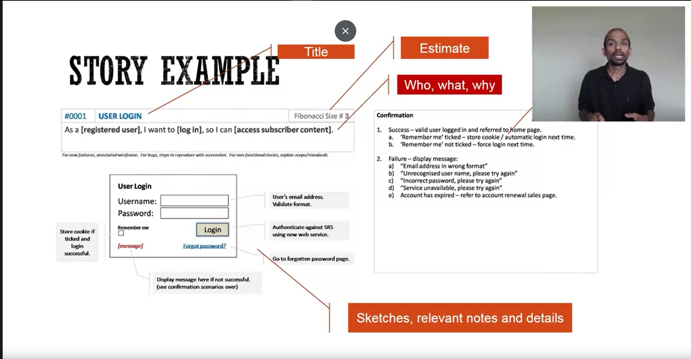

# Main ideas :
* Conversation : as a primary form of communication
* Adaptive : discover user needs vs. collect user needs
* Document : Just enough - just in time (Progressive refinement)

# User Story
The currency of AGILE development

## Card -> Conversation -> confirmation
* Card : token for convesation. Very high-level functionalities.
* Conversation : to build shared understanding
	* Who (want) What (and) Why?
	* Record facts/info to help you recall the conversation
	* Discuss what happens outside the software
	* Discuss what can go wrong.
* Confirmation : Acceptance tests.

## Templates to capture who / what / why?
* As a *role*, I want to *perform a task* so that *achieve this goal*
* *persona* wants to *perform a task* to *achieve this goal*
* Create your own...
* Doesnt need to be a template to be considered a story.

## Characteristic of a good user story : INVEST
I. independent
N. negotiable
V. valuable
E. estimable
S. small
T. testable

## How to write acceptance tests
* Questions to ask
	* Once the story is done, what client/product Owner will check to validate that it is indeed done?
	* What will we test to confirm that this story is done?
	* How will we demonstrate this software at a product review?
* Dont use technical terms that non-programming team members cant understand.
* Write the WHAT, not the HOW ("A manager can approve or disapprove an audit form" rather than "A manager can click an Approve/Disapprove radio button to approve an audit form")

### Example Acceptance test:
* User story : As an Administrator, I want to be able to create User Accounts so that I can grant users access to the system.

* Acceptance tests :
	* If I am an Administrator, I can create User Accounts.
	* I can create a User Account by entering the following information about the User :
		a. Name
		b. Email
		c. Phone Number
		d. License Number 
		e. Account Status (Active, Inactive)
		f. Reports to (from a list of Active Users)
	* I cannot assign a new User to report to an "Inactive" User.
	* I cannot assign a new User to report to a User if it creates a cyclical relationship (e.g., User 1 Reports to User 2 who reports to User 1 again)
	* The system notifies me that it sent an email to the new User's email address, containing a system-generated inital password and instructions for the person to login and change their password.
	* I am able to verify with the intended recipient of the email that it was received.
	
## Why write acceptance tests:
* Help you think through
* Help build common understanding between team members
* Team response time will improve.
* Help write test cases
* Help you slice work out.

## Stories can be written at many levels of abstraction
* Epic, Feature, Capability : Right sized for business
* User story : Right sized for users.
* Dev story, small user story : Right sized for development

## Spikes : 
* Knowledge Gathering Story
* For research/exploratory work
* Time-boxed
* Clear definition of done

## Non-functional requirements
* Handle them two ways:
	1. Have a definition of done (that will be applied to all stories when they'er done with the rest of development)
	2. Create specific stories (applicable to small part of the system)
* Make sure you have measurements for the "ilities"

