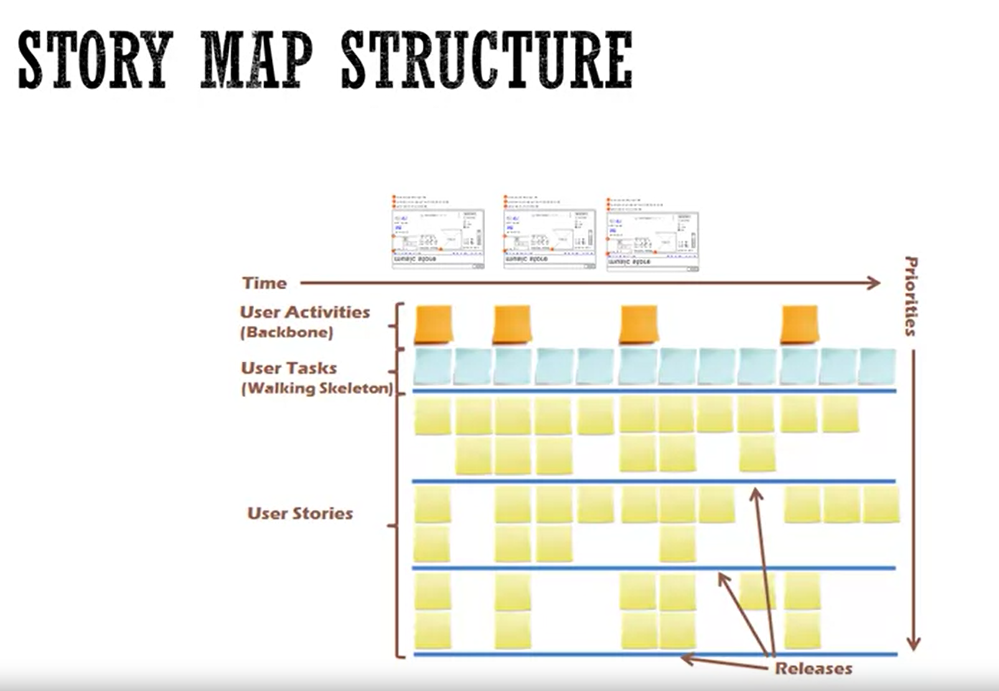

# GENERATING USER STORIES
Where do user stories come from
## User story writing Workshop
The simpler
### Goal
Write as many stories as you can for the selected theme.
### Who to invite?
* Product owner and other stakeholders who knows user needs
* Scrum Master
* Development team
### How long?
Few hours to few days
### Agenda
* Identify user - user analysis
* create personas
* Everybody start writing stories silently around the selected theme
	* Top Down : Big functionality -> ...-> stories
	* Bottom Up, group them later
	* Split them
	* ....

Then the product backlog is created
###	Good product backlog is:
* Detailed Appropriately
* Emergent
* Estimated
* Prioritized

## Story mapping
The better way to understand user need. It helps
* Discover user needs
* Organize and prioritize story backlog
* Understand and communicate user needs
* Plan release and development

### Making the story map
1. Frame the problem
	* Story - product teaser/story
	* What - name of the product, problem we are trying to solve
	* Who - the users and what benefit they gete.
	* Why - benefit to organization. What users do and how it results in benefits.
2. Map the big picture: 
	* Activities
	Tell a big story of the product by starting with the major user activities the system will be used for. Arrange activities left to right in the order you'd explain to someone who asked "What do people do with this system?"
	* User tasks
	Add task-centric stories in under each activity in workflow order left to right.
	If you were to explain what a person typically does in **an activity**, arrange tasks in the order you'd tell the story.
3. Explore : 
	* Variations
	Overlap user tasks vertically if a user may do one of several tasks at approximately the same time (or -> vertical, and then -> horizontal)
	* Details
	Captured detail should be kept. Consider tucking them under tasks cards to "hide them" from the discussion.
	* Go crazy
	Discuss, fill in, refine the map, test for completeness. Look for exceptions, consider others user, involve others...
4. Slice out viable releases
	* Slice map to holistic meaningful releases
	* Focus on outcome. Slice away what't not needed.
	* For each release indefify: Outcome, impact and success criteria.

### Why create them?
* Discover user needs - help discover missing pieces
* Understand and communicate user needs
* Planning
	* Provided a useful context for prioritization
	* Plan releases in complete and valuable slices of functionality
	* Organize and prioritize story backlog
* Foster co-ownership
* Flexible