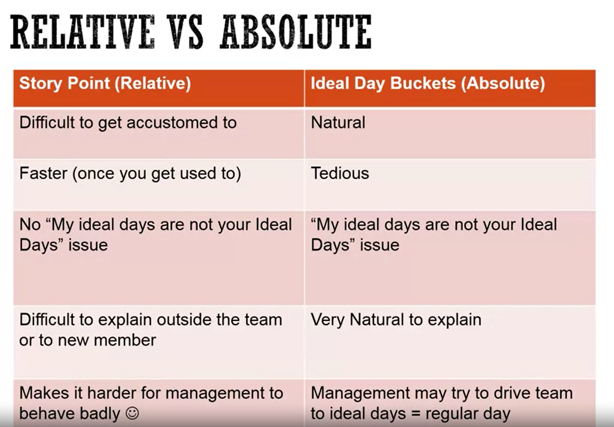

# Agile planning
* Effort (vs. Duration)
* Accuracy (vs. Precision)
* Relative (vs. Absolute)

### Ideal days : uninterrupted work days
### Estimation scale : sizing buckets. Stories is put into buckets
* Bucket size:
	* 1,2,4,8..
	* 1,2,3,5,8...
	* 1,5,10,20...
	* XS, S, M, L, XL...
* Can't estimate a story? add "?" as an option
* How many buckets? Depends
	* Less Buckets -> faster estimation, less Precision
	* More Buckets -> Slower estimation, more Precision
	* Diminishing return with more precision.

### Relative vs. absolute sizing
Human are good with relative sizing.
* Relative sizing : If story A is 1 point, then story B is 5 points
* Absolute sizing : A will take 1 day, B will take 5 days

