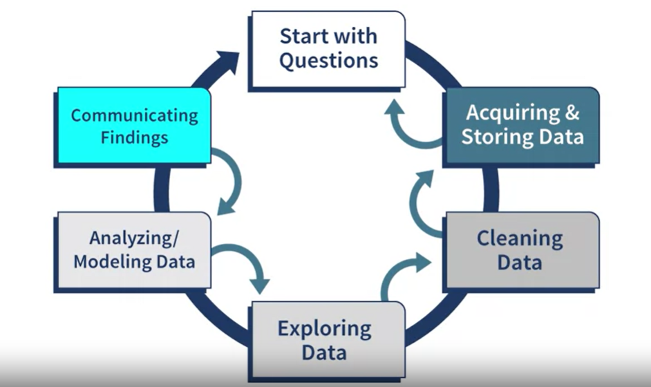

[Back to main index](../index.md)

## Big Data

A lot of data

> Data (Raw form of input)
> Information (Data - maybe organized and interpreted - that is useful)
> Knowledge (Information + Context)
> Wisdom (Knowledge built up and help to make infomed decisions)

## Big Data 10 Vs

- Volume
- Variety
- Velocity
- Variability
- Veracity (is the data truthful?)
- Vulnerability
- Visualizability (how hard to visualize this data)
- Value
- Validity
- Volatility

## Type of data

You can call a table's columm the data variable and the table's row a data point.

- Structured (In tables in database, with data points look exactly the same)
- Unstructured (Each data point is different from each other)
- Semi-structure (data point is slightly different - like each one is a image, but they're not in the same format)

## Analytic types

- Desciptive analytic : Say about the past - what happened?
- Predictive analytic : Predict the future - What is likely to happen?
- Precriptive : What should we do?

#### Pileline

process data on a regular basis. Outputs are likely the same format

#### Workflow

Used on one-off requests. Outputs could be different format.

## The pipeline

## Artificial Intelligence

- Narrow AI (Weak AI) - AI designed to do one task and that one task only.
- General AI (Strong AI) - AI can work like human.
- Superintelligence - AI that are smarter than human.

## Ambient Intelligence - AI that adapt to the environment(and the people living in it)

They are:

- Embedded
- Context aware
- Personalize
- Adaptive
- Anticipatory

Usually are networks of IOT devices

### Privacy risks

- Data collection
  > Ppl dont really know what type of data is being collected
- Transmission
  > IOT data are mostly unencrypted
- Storage
  > Data can be collected for foul purposes
- Access
  > Basically bad security. Lack of UI can be a problem too (cant access security options)
- Tracking
  > IOT systems be used to track people. Passive listening is kinda not very privacy-ish

## Blackbox problem

## Data Privacy Paradox

People say that they're concern about privacy do not act that way.

## PII - Personally Identifiable Infomation

Infomation can be used to identify a unique individual

- Direct Identifiers (ID number, Social security number, Driver License number, passport, fingerprints, biometric data...) Can be used to identify one person.
- Indirect PII (Others)

Combined info can create a PII (like how knowing a name of a person is not enough to find they, but knowing the name with a place of birth might)

    This term mostly used in the USA. EU has the term "Personal data, which is broader".

## Differential Privacy

Probability that a query will not reveal whether any one person is present in the data, let alone what data belongs to them.

## Protected Attributes

Protected attributes are characteristics of people that have been used for discrimination in the past. In some cases they are protected by law, often in relationship to employment.

Governments have different attributes listed in their discrimination laws, but most include:

- race, colour
- gender
- sexual orientation
- age
- physical or mental disability
- marital status
- family or carer responsibility
- pregnancy and maternity
- religion
- political opinion
- national extraction
- social origin

You should question whether this information is truly necessary for your work before the data is even collected. Ethically, all data-driven technologies where this data is being used should protect against using it being used for discrimination.

# Privacy Protection through Individual Authorization

## Informed Consent

> Consent can only be truly voluntary if the person can withdraw consent at any moment.

## Clear Privacy Policies

Privacy Policies should be easy to understand.

A suggestion say that Privacy policies should be written in 3 layers:

- Legal, written by lawers
- Consumer, written to be easy to understand by average user
- Machine, written for software systems.

#### Opt-out

Collect the data, unless the user say not to.

#### Opt-in

No data is collect, unless user say data can be collected.

# Privacy Protection through Individual Authorization

## Questions

- "Ethics by design"
- "Explainability"
- personhood
  > Personhood determines the rights, protections, privileges, responsibilities, liability, and duty of persons under the law of a society.
- strategic differentiator
- Beneficence
- non - maleficence
- electronic personalities
- engineering activism

# Autonomy

The ability for moral agents to make decisions without being coerce.
