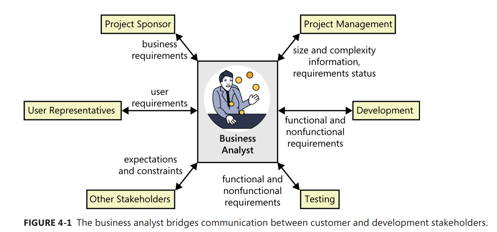

[Back to index](../req_eng_index.md)

## The Business Analysit (BA) role

The business analyst is the individual who has the primary responsibility to elicit, analyze, document, and validate the needs of the project stakeholders.

Business analyst is a project role, not necessarily a job title. Synonyms for business analyst include requirements analyst, systems analyst, requirements engineer, requirements manager, application analyst, business systems analyst, IT business analyst, and simply analyst. These job titles are used inconsistently from organization to organization.

## Business analyst's tasks

The analyst must first understand the business objectives for the project and then define user, functional, and quality requirements that allow teams to estimate and plan the project and to design, build, and verify the product. The BA is also a leader and a communicator, turning vague customer notions into clear specifications that guide the software team’s work.

This is some of the typical activities of a BA

- Define business requirements
- Plan the requirements approach
- Identify project stakeholders and user classes
- Elicit requirement
- Analyze requirements
- Document requirements
- Communicate requirements
- Lead requirement validation
- Facilitate requirement prioritization
- Manage requirement

## Essential Business Analyst skills

- Listening skills
- Interviewing an questioning skills
- Thinking on your feet
- Analytical skills
- Systemm thinking skills
- Learning skills
- Facilitation skills
- Leadership skills
- Observational skills
- Communication skills
- Organization skills
- Modeling skills
- Interpersonal skills
- Creativity

## The making of a business analyst

- The former user

  > They understand the business and the work environment, and they speak user's language.
  > However, they need to know more about software engineering and how to communicate with technical people.

- The former developer or tester

  > Project managers who lack a dedicated BA often expect a developer to do the job.
  > The developer-turned-analyst might need to learn more about the business domain. Developers can easily lapse into technical thinking and jargon, focusing on the software to be built instead of
  > the customers’ needs. They’ll need to get up to speed on current best practices for requirements
  > engineering.

  > Testers aren’t commonly asked to perform the analyst role. However, a tester often has an
  > analytical mindset that can lend itself to being a good BA. Testers are already used to thinking about
  > exceptions and how to break things, a useful skill for finding gaps in requirements.

- The former (or concurrent) project manage

- The subject matter expert

- The rookie

## The analyst role on AGILE
