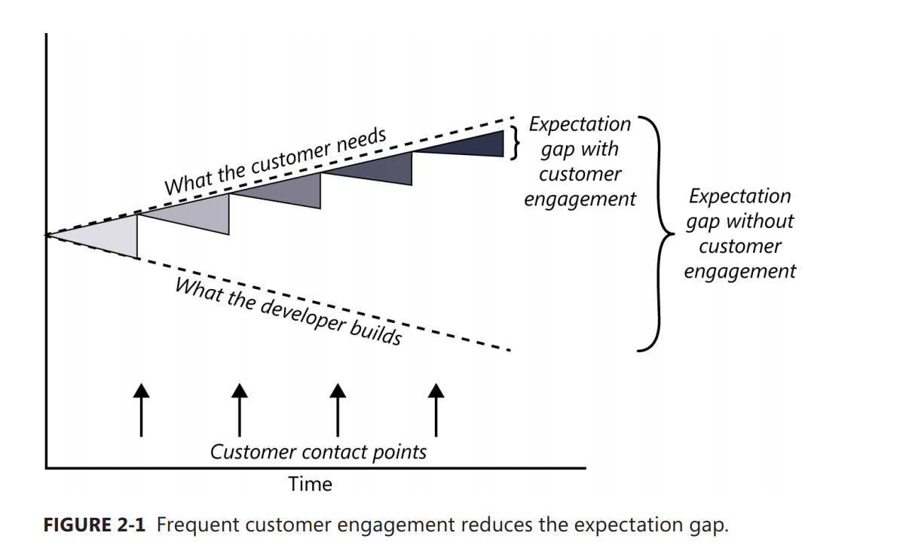
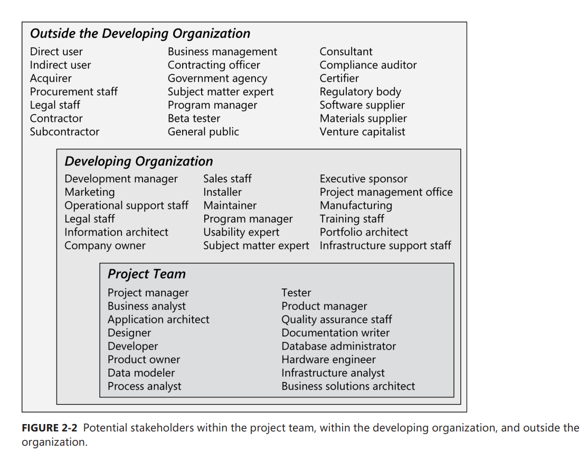
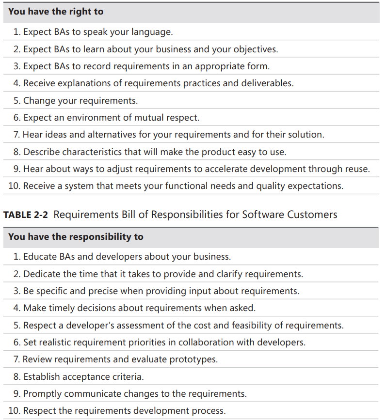

[Back to index](../req_eng_index.md)

# Requirement from the customer's perspective

## Exepectation gap

> Without adequate customer involvement, the inescapable outcome at the end
> of the project is an expectation gap, a gulf between what customers really
> need and what developers deliver based on what they heard at the beginning
> of the project (Wiegers 1996).

Different interpretations of the requirements by developers and customers lead to expectation gaps, in which the delivered product fails to satisfy customer needs. Peer review of requirements by developers, testers, and customers can mitigate this risk.

The best way to minimize the expectation gap is to arrange frequent contact points with suitable customer representatives. These contact points can take the form of interviews, conversations, requirements reviews, user interface design walkthroughs, prototype evaluations, and—with agile development—user feedback on small increments of executable software. Each contact point affords an opportunity to close the expectation gap: what the developer builds is more closely aligned with what the customer needs.

# Who is the customer

## Stakeholder

a person, group, or organization that is actively involved in a project, is affected by its process or outcome, or can influence its process or outcome. Stakeholders can be internal or external to the project team and to the developing organization.

Customers are a subset of stakeholders. A customer is an individual or organization that derives either direct or indirect benefit from a product. Software customers could request, pay for, select, specify, use, or receive the output generated by a software product. The customers shown in the picture include the direct user, indirect user, executive sponsor, procurement staff, and acquirer.

User requirements should come from people who will actually use the product, either directly or indirectly. These users (often called end users) are a subset of customers.

# Customer-development partnership

An excellent software product results from a well-executed design based on excellent requirements. Excellent requirements result from effective collaboration between developers and customers (in particular, actual users)—a partnership.

# Creating a culture that respects requirements

# Identifying decision makers

There is no single correct answer as to who should make key decisions. It's different per project. However, _**a small group represent key areas - management, customers, business analysis, development and marketing - generally work best**_

The decision-making group needs to identify its decision leader and to select a decision rule, which describes how they will arrive at their decisions. There are numerous decision rules to choose from, including the following (Gottesdiener 2001):

- The decision leader makes the choice, either with or without discussion with others.
- The group votes and the majority rules.
- The group votes, but the result must be unanimous to approve the decision.
- The group discusses and negotiates to reach a consensus. Everyone can live with the decision
  and commits to supporting it.
- The decision leader delegates authority for making the decision to one individual.
- The group reaches a decision, but some individual has veto authority over that decision.

There is no globally correct or appropriate decision rule. A single decision rule won’t work in every situation.

Chris, a seasoned PM, said

> I have found that there is usually one primary decision maker on a project,
> oftentimes the key sponsor within the organization.
> I don’t rest until I have identified that person,
> and then I make sure he is always aware of the project’s progress.

# Reaching agreement on requirements

Reaching agreement on the requirements for the product to be built, or for a specific portion of it, is at the core of the customer-developer partnership. Multiple parties are involved in this agreement:

- Customers agree that the requirements address their needs.
- Developers agree that they understand the requirements and that they are feasible.
- Testers agree that the requirements are verifiable.
- Management agrees that the requirements will achieve their business objectives.

## Requirement baseline

### **A requirements baseline is a set of requirements that has been reviewed and agreed upon and serves as the basis for further development.**

Whether your team uses a formal sign-off process or some other means of reaching agreement on requirements, the subtext of that agreement should read something like this:

> “I agree that this set of requirements represents our best understanding of the requirements for the next portion of this project and that the solution described will meet our needs as we understand them today.
> I agree to make future changes in this baseline through the project’s defined change process.
> I realize that changesmight require us to renegotiate cost, resource, and schedule commitments.”

Some organizations put text like this right on the signature page, so the requirement approvers know exactly what sign-off means in their world.

---

## Why requirement baseline is important

A shared understanding along these lines helps reduce the friction that can arise as requirements oversights are revealed or marketplace and business demands evolve over the course of the project.

A meaningful baselining process gives all the major stakeholders confidence in the following ways:

- Customer management or marketing is confident that the project scope won’t explode out of control, because customers manage the scope change decisions.
- User representatives have confidence that the development team will work with them to deliver the right solution, even if they didn’t think of every requirement before construction began.
- Development management has confidence because the development team has a business partner who will keep the project focused on achieving its objectives and will work with development to balance schedule, cost, functionality, and quality.
- Business analysts and project managers are confident that they can manage changes to the project in a way that will keep chaos to a minimum.
- Quality assurance and test teams can confidently develop their test scripts and be fully prepared for their project activities
