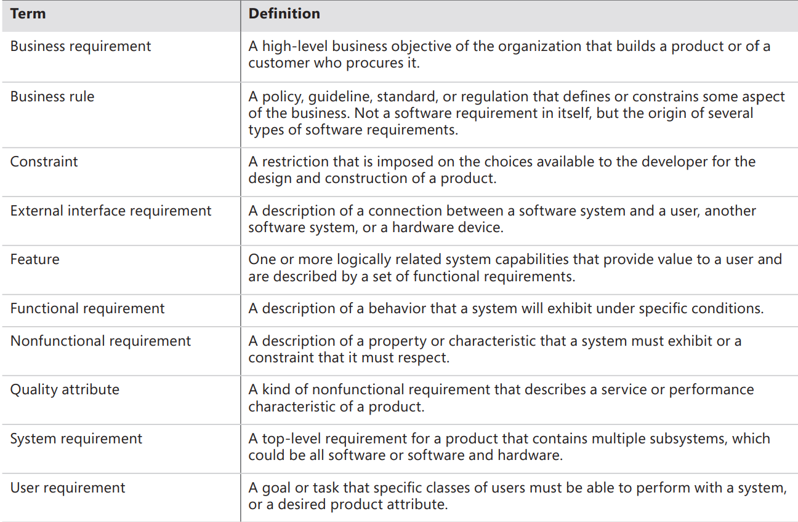
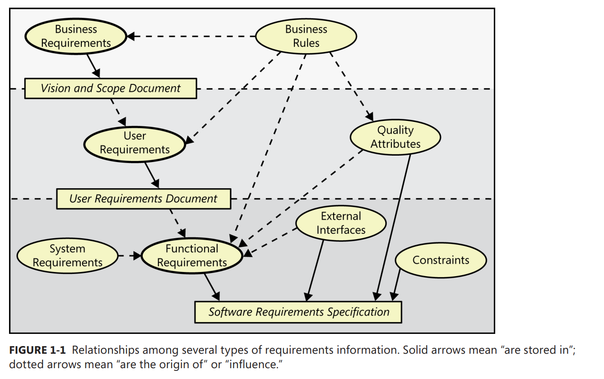
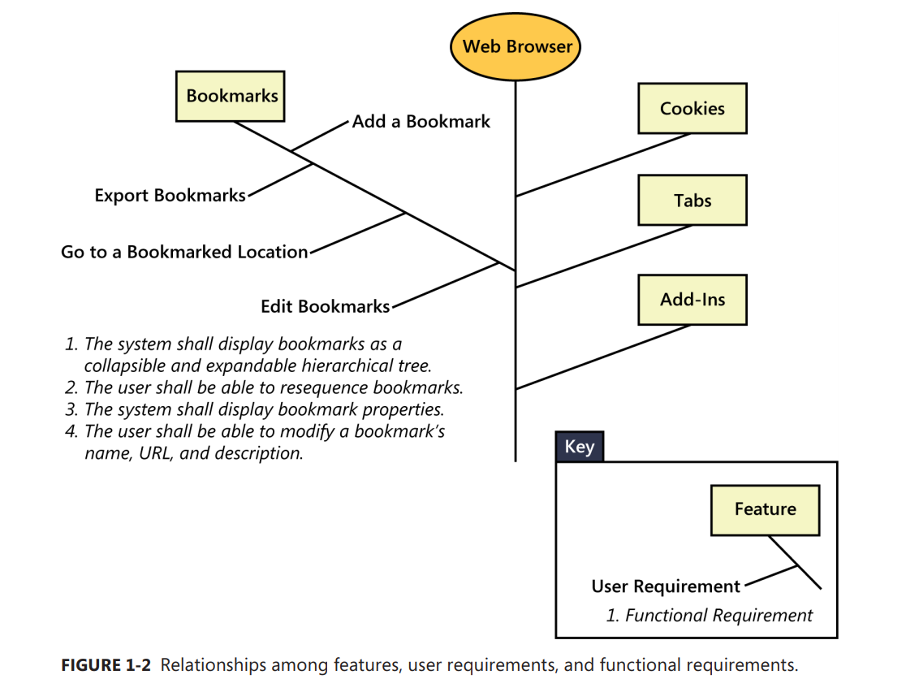
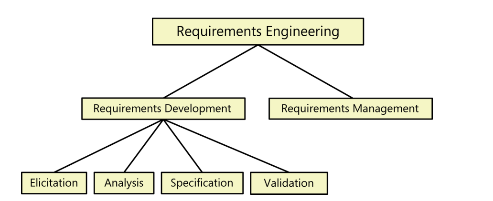

[Back to index](../req_eng_index.md)

# What really is requirement?

There are numberous different definitions about what is "requirement" and what is not. This is the definition that I use.

Ian Sommerville and Pete Sawyer (1997) :

> Requirements are a specification of what should be implemented. They are
> descriptions of how the system should behave, or of a system property or attribute.
> They may be a constraint on the development process of the system.

The term "requirement" is very overloaded, so we will need to unload it.

> "Essentially, all models are wrong, but some are useful."
> (Box and Draper 1987)

- Business requirements describe why the organization is implementing the system—the business benefits the organization hopes to achieve.

- User requirements describe goals or tasks the users must be able to perform with the product that will provide value to someone.

- Functional requirements specify the behaviors the product will exhibit under specific conditions.

- Business rules include corporate policies, government regulations, industry standards, and computational algorithms.

- System requirements describe the requirements for a product that is composed of multiple components or subsystems

- A feature consists of one or more logically related system capabilities that provide value to a user and are described by a set of functional requirements.

- Quality attributes are also known as quality factors, quality of service requirements, constraints, and the “–ilities.” They describe the product’s characteristics in various dimensions that are important either to users or to developers and maintainers, such as performance, safety, availability, and portability.

The business analyst (BA) documents functional requirements in a software requirements specification (SRS), which describes as fully as necessary the expected behavior of the software system.

# Requirement development and management

# Requirement development

## Elicitation

Elicitation encompasses all of the activities involved with discovering requirements, such as interviews, workshops, document analysis, prototyping, and others. The key actions are:

- Identifying the product’s expected user classes and other stakeholders.
- Understanding user tasks and goals and the business objectives with which those tasks align.
- Learning about the environment in which the new product will be used.
- Working with individuals who represent each user class to understand their functionality needs and their quality expectations.

## Analysis

Analyzing requirements involves reaching a richer and more precise understanding of each requirement and representing sets of requirements in multiple ways. Following are the principal
activities:

- Analyzing the information received from users to distinguish their task goals from functional requirements, quality expectations, business rules, suggested solutions, and other information
- Decomposing high-level requirements into an appropriate level of detail
- Deriving functional requirements from other requirements information
- Understanding the relative importance of quality attributes
- Allocating requirements to software components defined in the system architecture
- Negotiating implementation priorities
- Identifying gaps in requirements or unnecessary requirements as they relate to the defined scope

## Specification

Requirements specification involves representing and storing the collected requirements knowledge in a persistent and well-organized fashion.

## Validation

Requirements validation confirms that you have the correct set of requirements information that will enable developers to build a solution that satisfies the business objectives. The central activities are:

- Reviewing the documented requirements to correct any problems before the development group accepts them.
- Developing acceptance tests and criteria to confirm that a product based on the requirements would meet customer needs and achieve the business objectives.

# Requirement management

Requirements management activities include the following:

- Defining the requirements baseline
- Evaluating the impact of proposed requirements changes and incorporating approved changes into the project in a controlled way
- Keeping project plans current with the requirements as they evolve
- Negotiating new commitments based on the estimated impact of requirements changes
- Defining the relationships and dependencies that exist between requirements
- Tracing individual requirements to their corresponding designs, source code, and tests
- Tracking requirements status and change activity throughout the project

# No project without requirement

Frederick Brooks eloquently stated the critical role of requirements to a software project in his classic 1987 essay, “No Silver Bullet: Essence and Accidents of Software Engineering”:

> The hardest single part of building a software system is deciding precisely what to
> build. No other part of the conceptual work is as difficult as establishing the detailed
> technical requirements, including all the interfaces to people, to machines, and to
> other software systems. No other part of the work so cripples the resulting system if
> done wrong. No other part is more difficult to rectify later

## When bad requirements happened to good people

- Insufficient user involvement
- Inaccurate planning
- Creeping user requirement
- Ambiguous requirements
- Gold plating
  > The devs add functionality that wasn't in the requirements.
- Overlooked stakeholders

## With a high-quality requirement process:

- Fewer defects in requirements and in the delivered product.
- Reduced development rework.
- Faster development and delivery
- Fewer unnecessary and unused features.
- Lower enhancement costs.
- Fewer miscommunications.
- Reduced scope creep.
- Reduced project chaos.
- Higher customer and team member satisfaction.
- Products that do what they’re supposed to do.
