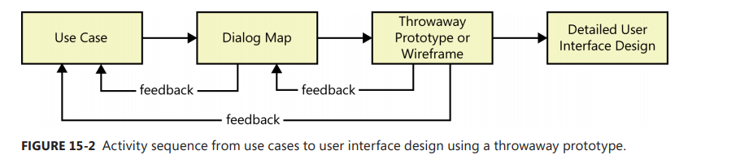

[Back to index](../req_eng_index.md)

# Risk reduction through prototyping

> The pharse IKIWISI - I'll know it when i see it chill the blood of the business analysist.

Prototypes are valuable tool for requirement validation. BA can have users interact with prototypes to see if a product based on the prototype would truly meet their needs.

## Prototyping: What anh Why

A software prototype is a partial, possible or preliminary implementation of a proposed new product.

Prototypes are useful for revealing and resolving ambiguity and incompleteness in the requirements.

Prototypes can serve three major purposes that must be made clear from the very begining:

- Clarify, complete and validate requirements
- Explore design alternatives
- Create a subset that will grow into the ultimate product.

For each Prototype, make sure you know and communicate

- Why you creating it
- What you expect to learn from it
- What you will do with the prototype after people had evaluate it.

You can put some descriptors in front of the word "prototype". When making prototype, these attriutes should be considered:

- Scope
  - Mock-up Prototypes (Focus on UX)
  - Proof-of-concept Prototype (Focus on the technical soundness or a proposed approach)
- Future use
  - Throwaway prototype (Discard after use)
  - Evolutionary prototype (Grow into the final product)
- Form
  - Paper prototype (draw on paper/board/any drawing tool)
  - Electronic prototype (working software or a part of the solution)

> Each prototype you create will possess a specific combination of these attributes. For instance, you could devise a throwaway paper mock-up having simple drawings of possible screens. Or you might build an evolutionary electronic proof-of-concept, working software that demonstrates a desired technical capability that you can then grow into a deliverable product.

## Mock-ups and proofs of concept

### Mock-ups

Also called a horizontal prototype - it focuses on the UI, doesnt dive into all the architectural layers or into detailed functionality.

Let you explore some specific behaviours of the intended system. Help users jubge whether a system based on the prototype will let them do their job in a reasonable way.

If you create a mock-up, try to use actual data. This enhances the validity of the prototype. To be sure, make it clear that the prototype only display simulated output, not live output. User should focus on borad requirements and workflow issues without being distracted by the precise apprearance of the screen elements.

### A proof of concept

also known as a vertical prototype, implements a slice of application functionality from the user interface through all the technical services layers.

It works like a real system.

Develop a Proof of concept when you're uncertain whether a proposed approach is feasible or not, when you want to optimize algorithms, evaluate a proposed database schema, confirm the soundness of a cloud solution or test critical timing requirements.

Agile development projects sometimes refer to a proof of concept prototype as a "spike"

## Throwaway and evolutionary prototypes

### Throwaway prototypes

Build to answer questions, resolve uncertainties and improve requirements quality.

Build as cheaply and as quickly as you can.

If there is merit to keeping it, you might want to refer it as the _nonreleasable prototype_

> Don’t make a throwaway prototype more elaborate than is necessary to meet the prototyping objectives. Resist the temptation—or the pressure from users—to keep adding more capabilities to the prototype.

It is most fit when the team faces uncertainty, ambiguity, incompleteness or vagueness in the requirements or when they have difficulty envisioning the system from the requirement alone. Resolving these issues reduces the risks of proceeding with construction

Wireframe is a approach to throwaway prototypingg commonly used for custom user interface design and website design. Wireframe can be used to understand The type of activities user might want to perform at any screen

Dialog map is also a useful tool.

## Evolutionary prototype

provides a solid architectural foundation for building the product incrementally as the requirements become clear over time.

The essence of evolutionaly prototyping is like how Agile teams do it

> Agile teams construct the product through a series of iterations, using feedback on the early iterations to adjust the direction of future development cycles.

It must be built with robust, production-quality code from the outset. Take longer to create than a throwaway prototype that simulate the same functionality.

Evolutionary prototypes work well for application that you know will grow over time, but can be valuable to users without having all the planned functionality implemented.

They apparently also work well with web development projects.

> Agile projects often planned such that they could stop development at the end of an iteration and still have a product that is useful for customers, even though it is incomplete.

## Paper and electronic prototypes

### Paper prototypes

AKA low-fidelity prototype

a cheap, fast and low-tech way to explore how a portion of an implement system might look. They let you take a tentative and low-risk step into a possible solution space prior to developing production code.

A similar deliverable is called a storyboard.

> When a low-fidelity prototype is being evaluated, someone will plays the role of the computer while a user walks through an evaluation scenario. The user initiates actions by saying aloud what they would like to do. The computer person then will display the piece of paper or the card that represent the display that would appear when the user takes that action. The user now can judge whether that is the expected response. If it's wrong, you simply take a blank page and try again.

You cant prototyping faster than sketching displays on papers. Paper prototyping facilitates rapid iteration, which is a success factor in requirements development.

### Electronic prototype

There are numerous tools available if you want to make a electronic throwaway prototype. They range from simple drawing tool (like MS Visio and MS powerpoint) to commercial prototyping tools and GUI builders. There are also tools specifically for creating wireframes.

If you are building a evolutionary prototype, you must use production development tools.

---

Prototyping is good and all, remember not to get drawn into pigh-precision UI design prematurely. Prototype evaluators often offer feedback like "Can this text be a little darker?", "Let's move this box up just a little" or " I dont like that font". Unless the purpose of the prototype is to perform detailed screen of webpage design, those sorts of comments are just distractions. Color, fonts and box positioning are immaterial if the application doesnt properly support the users' business tasks.

## Working with prototypes

progressive refinement:

This approach is cheaper than leaping directly from use case descriptions to a complete UI implemetations and then discovering major issues that necessitate extensive rework.

### Prototype evaluation

related to usability testing.
Watch users work with the prototype rather than just ask then to tell you what they think of it.

> Watch where the user's fingers or mouse try to go instictively. Spot places where the prototype conflict with the behaviour or other applications that the evaluators use. They might try incorrect keyboard shortcut or have to "mouse around" hunting for the correct menu option. Look for furrowed brow that indicates a puzzled user who cant determine what to do next, how to navigate to a desired destination, or how to take a side trip to another part of the application. See if the prototype has any deadends, as happens sometimes when a user submits a form on a website.

> Have the right people evaluate the prototype from the appropriate perspectives. Include members of multiple user classes, both experienced and inexperienced. When you present the prototype to the evaluators, stress that it addresses only a portion of the functionality.

To improve the evaluation of user interface prototypes, create scripts to guide the users through a series of operations and ask specific questions to elicit the inforamtion you seek. Example are:
- Does the prototye implement the functionality in the way you expected?
- What functionality is missiong from the prototype?
- Can you think of any possible error conditions that the prototype doesnt address?
- Are any unncecessary functions present?
- How logical and complete does the navigation seem to you?
- Are there ways to simplify any of the tasks that require too many steps?
- Were you ever unsure or what to do next?

Ask evaluators to share their thoughts alound as they work with the prototype so that you understand what they're thinking and can detect any issuses that the prototype handles poorly.

Avoid coaching users on the "right" way to perform some funtion with the prototype

Document what you learn from the prototype evaliation. Use the information to refine the requirements. 

If the evaluation led to some UI design decisions, such as the selection of specific interaction techiques, record those conclusions and how you arrived at them. Decisions that lack the accompanying thought processes tend to be revisited repeatedly.

For a proof of concept, document the evaluations you performed and their results, culmination in the decisions you made about the technical approaches explored. 

Resolve any conficts between the specified requirements and the prototype.

### Risks of prototyping

Creating even a simple prototype costs time and money. Although prototying reduces the risk ofsoftware project failure, it also has risks.

#### Pressure to release the prototype

In short, **NO**, A throwaway prototype is never intended for productio use, no matter how much it looks like the real thing. 

Expectation management is a key to successful prototyping. Everyone who sees the prototype must understand its purpose and its limitations.

One way to control this risk is to use paper rather than electronic prototypes. Noone who evaluates a paper prototype will think the product is nearly done.

Another option is to use prototyping tools that are different from those used for actual development. Noone will mistake a navigable PowerPoint mock-up or a simple wireframe for the real thing. 

Leaving the prototyping a bit rough and unpolished also mitigates this risk.
 
#### Distraction by details

User can become fixated on details about how the user interface will look and operate instead of conceptual issues at the requirements stage.

Limit the prototype to the displays, functions and navigation options that will let you clear up uncrertain requirements

#### Unrealistic performance expectations

Users might infer the expected performance of the final product from the prototype's performance. 

> If evaluators see the prototype respond instantaneously to a simulated database query (because hardcode), they might expect the same fabulous performance in the production software with an enormous distributed database.

Consider building in time delays to more realistically simulate the expected behaviour of the final product - and perhaps to make the prototype look even less ready for immadiate delivery.

You might put a message on the screen to clearly state that this is not necessarily representative of the final system.

> In an evolutionary prototyping situation, besure to design a robust and extendable architecture and crat high-quality code from the very begining. You are building production software, just at a small portion at a time. You can tune up the design through refractoring in later iterations, but dont subtitute refactoring in the future for thinking about design today.

#### Investing excessive effort in prototypes

Prototyping activities should not cost so much effort that the dev team run out of time and force to deliver the prototype as the product or to rush through a haphazard product implementation.

This can happen when you prototype the whole solution rather than the most uncertain, high-risk, or complex portions. 

Treat a prototype as an experiment. You're testing the hypothesis that the requirements are sufficiently defined and the key human-computer interface and architectural issues a resolved so that design and construction can proceed. 

Do just enough prototyping to test the hypothesis, answer the questions, and refine the requirement.

## Prototyping success factors

To make prototyping an effective part in your requirement process, follow these guidelines

- Include prototyping tasks in the project plan. Schedule time and resources to develop, evaluate and modify the prototypes.
- State the purpose of each prototype before you build it, and explain what will happen with the aoutcome. Make sure those who build the prototypes and those who evaluate them understand these intentions.
- Plan to develop multiple prototypes. You rarely get them right on the first try.
- Create throwaway prototypes as quickly and cheaply as possible. Invest the minimun amount of effort that will answer questions or resolve requirements uncertanties. Dont try to perfect a throwaway prototype.
- Dont include input data validation, defensive coding techniques, error-handling or extensive code documentation on a throwaway prototype. Its uncecessary.
- Dont prototype requirement that you already understand, except to explore design alternatives
- Use plausible data in prototype screen displays and reports. Evaluators can be distracted by unrealistic data and fail to focus on the prototype as a model of the real system.
- Dont expect a prototype to replace written requirements. A lot of behind-the-scences functionality is only implied by the prototype and should be documented in an SRS to make it complete, specific and traceable.

---

Thoughtfully applied and skillfully executed prototypes are a valuable tool to help with requirements elicitations, validation and that tricky translation from needs into solutions.
