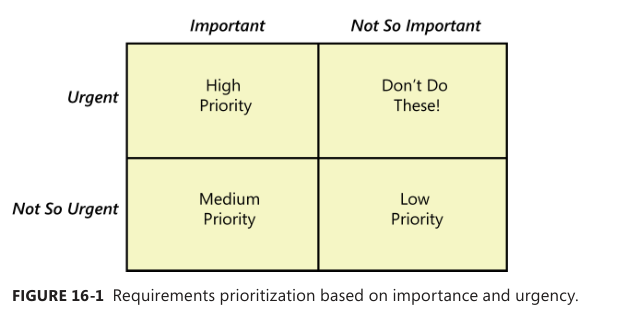
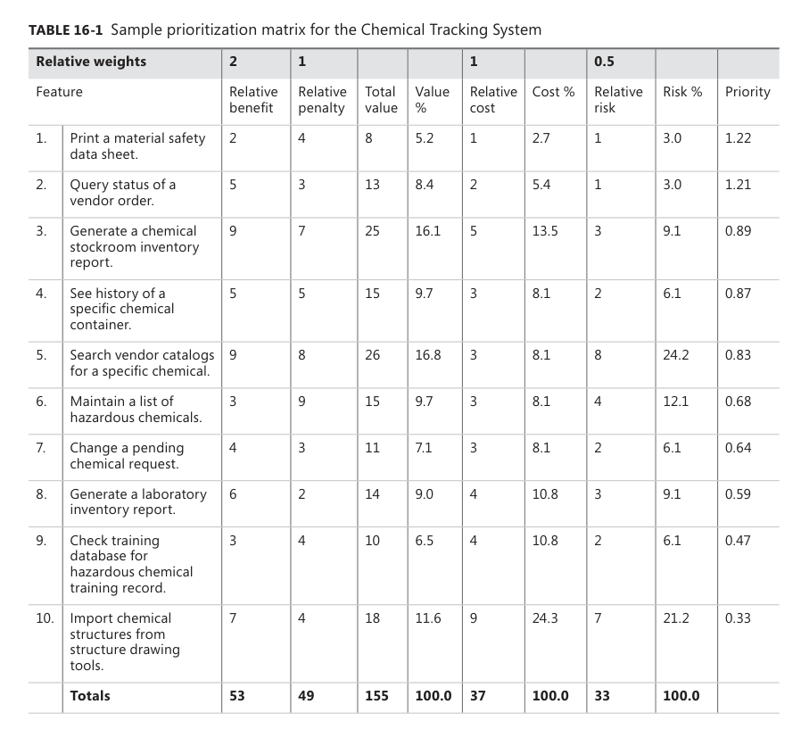

[Back to index](../req_eng_index.md)

# Setting requirement priorities

> Few software projects deliver all the capabilities that all stakeholders want by the targeted initial delivery date. 

Prioritization, also called requirement triage, helps:
- Reveal Competing goals
- Resolve conflicts
- Plan for staged or incremental deliveries
- Control scope creep
- Make the necessary trade-off decisions

## Why prioritize requirements

When customer expecctations are high and timelines are short, you need to make sure the product delivers the most critical / valuable functionality asap.

It is a way to deal with completing demands for limited resources. It lets you plan construction to provide the highest value at the lowest cost.

It is a critical strategy for agile or any other projects that develop products through a series of fixed-schedule timeboxes.

## Some prioritization pragmatics 

Even a medium-sized project can have dozens of user requirements and hundreds of functional requirements.

To keep it manageable, choose an appropriate level of abstraction for the prioritization - you can prioritize features, use cases, user stories or functional requirements.

> You might decide to do an initial prioritization at the feature level and then to prioritize the functional requirements within features seperately.

Various stakeholders need to participate in prioritization, repesenting customers, project sponsors, project management, development, and other perspectives. You also need a ultimate decision maker in case stakeholders cant agree.

The prioritization could include considerations of customer value, business value, business or technical risk, cost, difficulty of implementation, time to market, regulatory or policy compliance, competiive market advantage and contractual commitments.

These six issues need to be understood:
- Needs of customers
- The relative importance of requirements to the customers
- The timing at which capabilities need to be delivered
- requirements that are predecessors for other requirements and other relationships
- Requirements must be implemented as a group
- The cost of each requirement

## Some prioritization techniques

### In or out

Have a group of stakeholders work down a list of requirements and make a binary decision : is it in, or is it out? Keep refering to the project's business objectives when making this judgementm paring the list down to the bare minimum needed for the first release, then go back to the previously "out" requirements and repreat the process.

### Pairwise comparison and rank ordering

Assign a unique priority sequence number to each requirement. Rank ordering a list by making pairwise comparison between all of them.

This should be done in batches, as doing this with more than a couple of dozens requirements will be unwieldly.

> Rank ordering all requirements by priority is overkill. You should group them together in batches by release or development time box. Grouping requirements info features or into small sets of requirements that must be implemented together is sufficient.

### Three level scale 

Group requirements into three categories: High, Medium and Low priority.

> This scale is subjective and imprecise. To make the scale useful, stakeholders must agree on what level means in the scale they use.

Another way to do this is to consider each requirement on two dimetions of importance and urgency. 

Every requirement can be considered as either important to achieveing business objectives or not so important, and as being either urgent or not so urgent
These alternative yield four different combinations, which you can used to define a priority scale.

> Remember to include the priority of each requirement in document: user requirements documents, the SRS or the requirements database. Establish convention so that the reader know whether the priority of a high-level requirement is inherited by all its suboridates, or every individual functional requirements is to have its own priority.

> Sometime, you might want to perform prioritization iteratively (like on large projects). Have the team rate the requirements into three categories like mentioned above. If the High priority is excessive, you can perform a second partitioning of the High-priority requirements (you can name the three cat here "high", "higher" and "highest" just to avoid confusions). Group the "high" and the "higher" into the original "medium"

---

When using the three-level scale, aware of the requirements dependencies. You will run into problems if a high-priority requirement is dependent on another that is of lower priority group.

### MoSCoW

Must, Should, Could and Won't

Change the three-level scale into a four-level. Won't doesnt mean not doing and you need to communicate it. Not recommended

### $100

Give the prioritization team 100 imaginary dollars to work with. Team members allocate thse dollars to buy items that they would like to have implements from the complete set of candidate requirements. 100 dollars is all the prioritizers get - when they're out of money, nothing else can be implemented.

Add up the total number of dollars assigned to each requirements to see which one collectively comeout as having the highest priority.

> This is not a bad way, however, there are ways people can game the process to skew the results. If you really want a particular requirement, you can give it all 100 to float it to the top, for example. This scheme also does not take into account the effort needed for each requirement.

There are variations. You can also use real money.

### Prioritization based on value, cost and risk.

A more formal and analytical method.

This technique is called Quality Function Deployment or QFD.

_benefit_ is the relative value provided to the customer if  aspecific product feature is present

_penalty_ is the relative value paid if the feature is missing.

A feature attractiveness is inversely proportional to its _cost_ and the technical _risk_ associating with it and proportional to its benefit.

Aplly this prioritization to those that arent obviously top priority. 

Typical participants in the prioritization process include:
- PM or BA, who leads the process, arbitrates conflicts and adjust prioritization data recieved from other participants of necessary.
- Customer representatives like product champions, product manager or a product owner to supply the benefit and penalty rating.
- Development representatives to provide cost and risk ratings.

Follow these step to use this prioritization model (more complicated to explain that to use):

1. List in the spreadsheet all the features, use cases, use case flows, user stories or func requirement you want to prioritize against each other. All items must be at the same level of abstraction - dont mix functional requirements with features. Certain features might be logically linked or have dependencies. For those, include only the driving feature in the analysis. If you have more than several dozens items (or it has become unwieldy), group related items together.
2. Have the customer representatives estimate the relative benefit each feature would provide to the customer/business on a scale of 1 to 9 with 1 is low value and 9 is high value.
3. Estimate the relative penalty that the customer/business would suffer if each feature were not included. Use a scale of 1 to 9.
> Sometime, a feature could have low value (not many customer will use it) but will have a high penalty as your competitor's product boasts that feature and the customer expect it to be there even they dont personally plan to use it. Marketing people call these "checkbox features": you need to say you have it, even if few people really care. 
> When assigning penalty ratings, consider these:
> - would your product suffer in comparison with others that dp have that feature?
> - Would there be any legal or contractual consequences?
> - Would you be violation any gov or industry standard?
> - Would users unable to perform some necessary or expected functions?
> - Would it be a lot harder to add that feature later as an enhancement?
> - Would problems arise because marketing promised a feature to some customers?
4. Calculate the total value for each feature as the total value for each feature as the sum of its benefit and penalty scores (weighted, describe later). Then, calculate the precentage of the total value that comes from each of the features. Note that this is the percentage compare to the set of features you're prioirtizing, not the entire product. 
5. Estimate the relative cost of implementing each feature, 1 to 9.
6. Estimate the risk associated with each feature, 1 to 9. This is technical risk, not business risk. Technical risk is the probability of not getting the feature right on the first try. Also 

7. Calculate a priority value for each feature using : priority = value% / (cost% + risk%). Note, values are precentages.
8. Sort the features in descending order by the calculated priority.

You can weight the stats differently.

When using this speardsheet model with prioritization participants, you might want to hide certain columns like the Total value, Value %, Cost % aand Risk %. These are intermediate results from calculations that could be a distraction.

This model usefulness is limited bu the team's ability to estimate the benefit, penalty, cost and risk for each item. Use the calculated priorities only as a guideline.

---

Keep your prioritization process as simple as possible, but no simpler. Strive to move prioritization away from the political and emotional arena into a forum in which stakeholders can make honest assessments. This will give you a better change of building products that deliver the maximum business value with the minimum cost.

