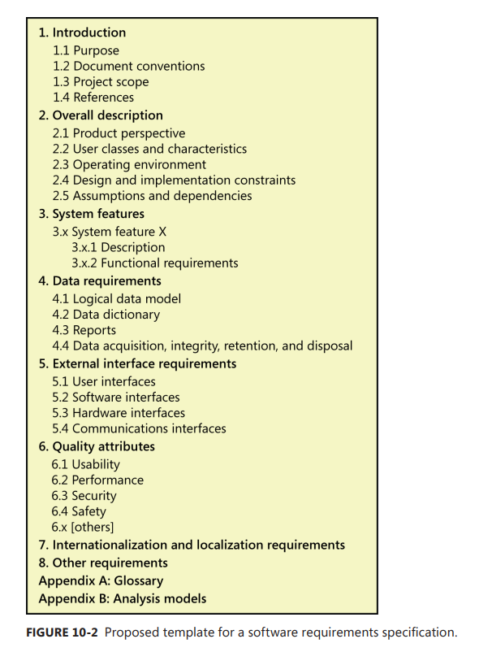

[Back to index](../req_eng_index.md)

# The Software Requirement Specification

## Template

### 1. Introduction

> Present an overview to help the reader understand how the SRS is organized and how to use it.

- 1.1 Purpose
  > Identify product/app, including the release number. If the SRS pertains a part of a complex system, identify that portion.
  > Identifying different types of readers that the document is intended for - devs, pms, marketings, users, testers and doc writers.
- 1.2 Document conventions.
  > Desc any standard or typographical conventions used, meaning of specific text styles, highlighting or notations. Also include labeling conventions.
- 1.3 Project scope
  > A short desc about the software being specified and its purpose. Relate the software to business objectives and strategies.
  > An SRS that specifies an incremental release of an evolving produt should contains its own scope statement as a subset of the long-term strategic product vision. You might provide a high-level summary of the major features the release contains or the signigicant functions that it performs.
- 1.4 References
  > Link to useful documents/resources. Provide enough information so that the reader can access each reference.

### 2. Overall description

> Presents a high-level overview of the product and the environemnt in which it will be used, the anticipated users, known constrants, assumptions and dependencies.

- 2.1 Product perspective
  > The product's context and origin. Considering including visual models such as a context diagram or ecosystem map to show the product's relationship to other systems.
- 2.2 User classes and characteristics.
  > Identifying the various user classes that you anticipate will use this product, and describe their pertinent characteristics. Also identifying flavored user classes.
- 2.3 Operating environment
  > Hardware platform, OS and versions, geographical locations of users, servers and databases. organizations that host the related databases, servers and websites. If extensive technical infrastructure work needs to be performed in conjunction with developing the new system, consider creating a seperate infastructure requirements specification to detail that work.
- 2.4 Design and implementation constraints
  > Any factors that will restrict the options available to th developers and the rationale for each constraint. Watchout for unnecessary design constraints.
- 2.5 Assumptions and dependencies
  > The Assumptions included here are those related to system functionalities. Also identify any dependencies the project or system being built has on external factors or components outside of its control. For example, if Microsoft .NET framework 4.5 or a more recent version must be installed before your product can run, that's a dependency.

### 3. System features

> This template organized functional requrements by system features, which is not the only way. Options include arranging requirements by functional area, process flow, use case, mode of operation, user class, stimulus and response. Choose one or combine the that make it easy for readers to understand the product's intended capabilities.

- 3.x System feature X
- 3.x.1 Description
  > Short desc of the feature and its priority.
- 3.x.2 Functional requirements
  > Software capablities that must be implemented for the user to carry out the feature's services or to perform a use case. Also desc how the product should respond to anticipated error conditions and to invalid inputs and actions.

### 4. Data requirements

> Describe various aspects of the data the the system will consume as inputs, process in some ways or create as outputs.

- 4.1 Logical data model

  > Visual representation of the data objects and collections and the relationships between them. Models like the ERD and UML class diagram can be used. This is not the same as an implementation data model that will be realized by database design.

- 4.2 Data dictionary
  > Defines the composition of data structures and the meaning, data type, length, format and allowed values for the data values for the elements that make up those structures. In many cases, this should be store in a seperate artifact.
- 4.3 Reports
  > If the application generate reports, identify them here and descibe their charateristics.
- 4.4 Data acquisition, integrity, retention and disposal.
  > If relevant, describe how data is acquired and maintained. State any requirements regarding the need to protect the integrity of the system's data.

### 5. External interface requirements

> Provides informaton to ensure that the system will communicate properly with users and with external hardware or software elements. Reaching agreement on external and internal system interfaces is industry best practice.

- 5.1 User interfaces
  > The logical characteristic of each user interface that the system needs. Some items to address are:
  >
  > - Ref to UI standard or product line style guides that are to be followed.
  > - Standard for fonts, icons, button labels, images, color schemes, field tabbing sequences, commonly used controls, branding graphics, copyright and privacy notices...
  > - Screen size, layout,resolution constraints
  > - Standard buttons / links that will appear on every screen, such as a help button
  > - Shortcut keys
  > - Message display and phrasing conventions
  > - Data validation guidelines
  > - Layout standards to facilitate software localization
  > - Accommondations for users with visual imparement, colorblindness or other limitations.
- 5.2 Software interfaces
  > Interfaces between this product and other software components
- 5.3 Hardware interfaces
- 5.4 Communications interfaces
  > Any communication functions the product will use, including email, web browser, network protocols and electronic forms.

### 6. Quality attributes

> Non functional requirements other than constraints. These quality requirements should be specific, quantatitative and verificable.

- 6.1 Usability
  > Ease of learning, ease of use, error avoidance and recovery, efficciency of interactions and accessibility.
- 6.2 Performance
  > State specific performance requirements for various system operations.
- 6.3 Security
  > Any requirement regarding security or privacy issues that restrict access to or use of the product.
- 6.4 Safety
  > Requirements that are concerned with possible loss, damage or harm that could result from the use of the product. Define any safeguards or actions that must be taken, as well as potentially dangerous actions that must be prevented.
- 6.x (Others)
  > Describe any attributes that might be valuable to customers, developers or maintainers. Possibilities include availablility, efficiency, installability, integrity, modifiability, scalability...

### 7. internationalization and localization requrements.

> Ensure that the product will be suitable for use in nations, cultures and geographic locations other than those in which it was created. Might addresses differences in currenccy, formatting of dates, numbers, addresses and telephones numbers, language including dialects, names orders, time zones, electrical voltages and plug shapes...

> This can be reused accoss projects.

### 8. (Other requrements)

> Examples are legal, regulatory, finacial compliance and standards requirements.

### Appendix A : Glossary

> Define any specialized terms that the reader needs to know to understand the SRS, including acronyms and abbreviations.

> Notes that data definitions belong in the data dictionary, not the glossary.

### Appendix B : Analysis models

> Includes or points to pertinent analysis models such as data flow diagrams, feature trees, state-transition diagrams or entity-relationship diagrams.
