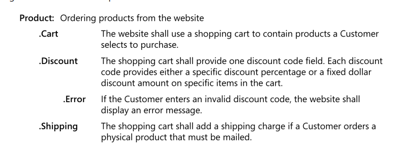

[Back to index](../req_eng_index.md)

# Software Requirement Specification Notes

> Doesnt necessarily stored in a classic word-processed document. Spreadsheet, a wiki, a database, or a Requirement Management tool could also do.

> In fact, using tradition word document pose numerous limitations:
>
> - Difficult to reatain historical versions of the requirements
> - Change management is clumsy.
> - Difficult to store descriptive attributes along with the requirements.
> - Not easy to subset out a portion of requirements that are allocated to a particular itertion or keep track of those that were once approved but then deferred or canceled.
> - It's hard to trace requirements to other developments to other development artifacts.
> - Duplicating a requirement that logically fits in multiple places causes maintenance issues.

> On exploratory or highly volatile projects where you’re not sure what solution you’ll end up with, trying to keep up with changes in the requirements details adds little value.

You can represent software requirement in several vays, including:

- Well-structured and carefully writtend natural language.
- Visual models that illustrate transformational processes, system states and changes between them, data relationships, logic flows, etc...
- Formal specifications that define requirements by using mathematically precise specification languages.

Formal specs provide the greatest rigor and precision, but few devs - and fewer customers - are familiar with them.

Structured natural language, augmented with visual models and other representation methods remains the most practical ways for most projects.

## The SRS

> Goes by many names, SRS is industrial standard names

The SRS states the functions and capabilities that a software system must provide, its characteristics and the constrains it must respect. It should describe as completely as necessary the system's behaviours under various conditions, as well as desired system qualities such as performance, security and usability. It should not contain design, construction, testing or project management design other than known design and implementation constrains.

**Audiences of SRS**:

- Customers, the marketing department, and sales staff need to know what product they can expect to be delivered.
- PMs base their estimates of schedule, effort and resources on the SRS.
- Dev team need to know what to build
- Testers use it to develop requirements-based tests, test plans and test procedures.
- Maintenance and support staff use it to understand what each part of the product is supposed to do.
- Documentation writers base user manuals and help screens on the SRS (and UI design)
- Training personnel use SRS and user documentation to develop educational materials
- Legal staff ensures that the requirements comply with applicable laws and regulations.
- Subcontractors base their work on - and can be legally held to - the SRS

You dont have to write SRS for the entire product before begining development, but you should capture the requirements for yeach increment before building that increment.

**SRS must be written so that the stakeholders can understand it**. Keep these readability suggestion in mind.

- Use an approproate template to organize all the necessary information.
- Label and style sections, subsections and individual requirements consistently.
- Use visual emphasis (bold, underline, italics, color and fonts) consistently and judiciously. Remember that color highlighting might not be visible to people with color blindness or when printed in grayscale.
- Create a table of contents to help readers find the information they need.
- Number all figures and tables, give them captions and refer to them by number.
- If you are storing requirements in a document, define your word processor’s cross-reference facility rather than hard-coded page or section numbers to refer to other locations within a document.
- If you are using documents, define hyperlinks to let the reader jump to related sections in SRS or in other files.
- If you are storing requirements in a tool, use links to let reader navigate to related information.
- Include visual representations of information when possible to facilitate understanding.
- Enlist a skilled editor to make sure the document is coherent and uses a consistent vocabulary and layout.

## Labeling requirements

Requirement needs a unique and persistent identifier.

> This allows you to refer to specific requirements in a change request, modification history, cross-reference, or requirements traceability matrix. It also enables reusing the requirements in multiple projects. Uniquely identified requirements facilitate collaboration between team members when they’re discussing requirements

## Sequence number

The simplest approach gives every requirement a unique sequence number. Such as UC-9 or FR-26.

The prefix indicates requirement type, and the number is not reused if a requirement is deleted.

> This simple numbering approach doesnt provide any logical or hierachical grouping or related requirements, the number doesnt imply any kind of ordering, and the labels give no clue as to what requirements is about. It does make it easy to retain a unique identifier if you moce rerquirements around in a document.

### Hierachical numbering

Most commonly used convention. Each section starts with a number, its subsections will also have their parent's number in their number.
More digits means more detail, lower-level requirement.

> If the functional requirement appear in section 3.2 of your SRS then all functional requirements will begin with 3.2.

> 3.2.4.3 is a child requirement of 3.2.4

This method is simple, compact and familiar. All tools generally do this automatically.

> However, hierachical numbering can grow too manu digits in even a medium-sized SRS. Numeric labels also tell you nothing about the intent of a requirement. persistent labeling might become a problem.

An improvement over hierachial numbering is to muber the major sections of the requirements hierachically and then identifying individual functional requirements in each section with a short text code followed by a seequence number.

> For example, the SRS might contain "Section 3.5 - Editor Functions" amd the requirements in that section could be labeled ED-1, ED-2 and so forth.

### Hierachical textual tags

> A suggestion

Consider this requirement: "The system shall ask the user to confirm any request to print more than 10 copies. This requirement might be tagged **Print.ConfirmCopies**, this indicates that it is part of the print function and relates to the number of copies to print, Hierachical textual tags are structured, meaningful and unaffected by adding, deleting or moving other requirements.

## Imcompleteness

Sometime, you lack info about a requirement. Maybe tag/flag that requirement with something like a WIP/TBD (to be determined) mark.

If you must proceed with construction of the next product increment while TBDs remain, either defer implementing the incompleted requirements or design those portions to be easily modifiable when the issues are resolved.

## UI in the SRS

Incorporation UI designs in the SRS has both benefits and drawbacks.

- Exploring UI with paper prototypes, working mock-ups, wireframes or simulation tool make the requirements tangible to both users and developers.
- Screen images and UI architectures describe solutions and might not truly be requirements. Including them make the document larger, take longer to make and slow down development.
- including UI in requirements can result in the visual design driving the requirements, which often lead to functional gaps.
- Early visualization can clarify requirements, but it can also lead to resistance to improving the UI.

> To implement certain functionality with specific UI controls and screen layouts, it’s both appropriate and important to include that information in the SRS as design constraints. Design constraints restrict the choices available to the user interface designer. Just make sure that you don’t impose constraints unnecessarily, prematurely, or for the wrong reasons.

> If the SRS is specifying an enhancement to an existing system, it often makes sense to include screen displays exactly as they are to be implemented. The developers are already constrained by the current reality of the existing system, so it’s possible to know up front just how the modified—and perhaps also the new—displays should look.

Else, UI in SRS should only be sketches of selected displays without demanding that the implementation precisely follow those models.

Sketches in SRS help communicate UI in the requirement, but make it clear that the sketch are not committed screen designs.

> UI should be in a seperate document/tool when projects have a lot of screens. This make them more manageable.
