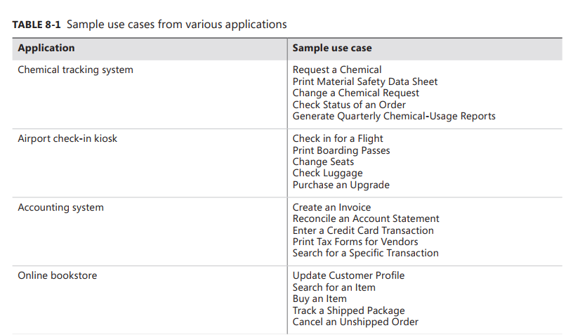
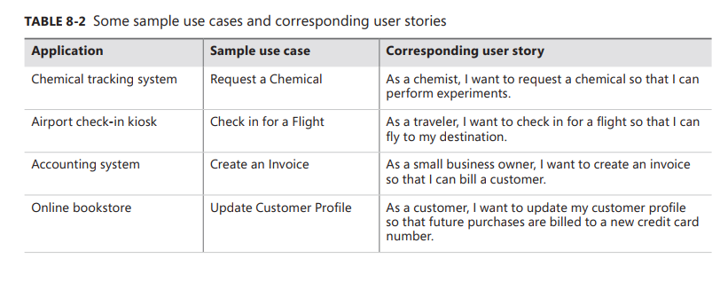

[Back to index](../req_eng_index.md)

# To understand user requirement

User requirements are found in the second level of requirements. They lie between the **business requirements** (the objectives for the projects) and **functional requirements** (what developers moust implements)

Two of the most commonly employed techniques for exploring user requirements are **use cases** and **user stories**

> Use cases and user stories work well for exploring the requirements for business applications, websites, kiosks, and systems that let a user control a piece of hardware. However, they are inadequate for understanding the requirements of certain types of applications. Applications such as batch processes, computationally intensive systems, business analytics, and data warehousing might have just a few use cases. The complexity of these applications lies in the computations performed, the data found and compiled, or the reports generated, not in the user-system interactions.

> Nor are use cases and user stories sufficient for specifying many embedded and other real-time systems. Consider an automated car wash. The driver of the car has just one goal—to wash the car—with perhaps a few options: underbody spray, sealer wax, polish. However, the car wash has a lot going on. It has a drive mechanism to move your car; numerous motors, pumps, valves, switches, dials, and lights; and timers or sensors to control the activation of these physical components. You also have to worry about diagnostic functionality, such as notifying the operator when a tank of liquid is nearly empty, as well as fault detection and safety requirements. What happens if the drive mechanism fails while a car is in the tunnel, or if the motor on a blower fails? A requirements technique often used for real-time systems is to list the external events to which the system must react and the corresponding system responses.

## Use cases and user stories

A **use case** describes a sequence of interactions between a system and an external actor that results in the actor being able to achieve some outcome of value.

The names of use cases are always written in the form: verb + object.

A **user story** is a "short, simple description of a feature told from the perspective of the person who desires the new capability, usually a user or customer of the system".
They usually follow this template

> As a &lt;type of user&gt;, I want &lt;some goal&gt; so that &lt;some reason&gt;

using this template is more advatangeous than using the short use cases, because it also state the rationale behing the request for that system capability,

The user class - which need not be a human being - in a user story corresponds to the primary actor in a use case

## The use case approach

The essential elements of a use case are the following:

- A unique identifier and a succinct name that states the user goal
- A brief textual description that describes the purpose of the use case
- A trigger condition that initiates execution of the use case
- Zero or more preconditions that must be satisfied before the use case can begin
- One or more postconditions that describe the state of the system after the use case is successfully completed
- A numbered list of steps that shows the sequence of interactions between the actor and the system - a dialog - that leads from the preconditions to the postconditions
