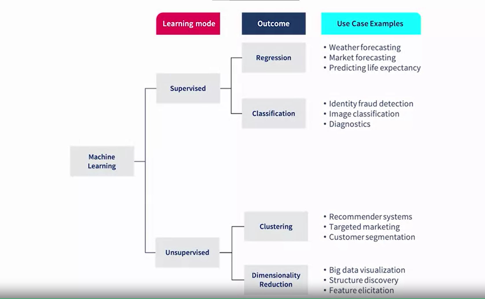

# Risk management Process

- Identification
- Analysis
- Mitigation

## Identification

Can be made by a brainstorming session including various stakeholders for more perspective.

> Asking : What risk can this project bring about?

Can use key documents like Project Requirement.

Look at all the factors critical to the project sucess, and ask: what might go wrong, and what will be it impact?

Should document all the risk you identified.

Periodically revisit it throughout your project lifecycle.

## Analysis

Breaking down the risks into components

- Root cause : what leads to the risk
> 
- Symptom : what the root causes.

Symptoms are much easier to identify than the root. Look and deal with the root, not the symptoms.

### Qualitative analysis

Describe each risk with its likeliness to occur and it impact if occur. Can be used to prioritize risks.

Used words like "low, medium, high" to describe risks. 

Very subjective.

### Quantitative analysis

Used number to describe risk. Based on statistics of historical data.

Can be very complex, and not every risks can be analysed this way.

## Mitigation

Minimize the risk likelihood and impact.

you can also:
- Avoiding the risk
- Tranfering the risk (move the risk dealing to thirdparty)
- Accepting the risk

## Type of risks

- Privacy risks
> Privacy mean individual/group can choose to not share their information.
- Accountability risks
> Accountablity mean someone should be held responsible for an action.
- Tranparency and Explainability risks
- Fairness and non - discimination risks
- Safety and security risks

# Machine learning

data --> Algorithm --> model

different set of data into the same algorithm will produce a different model

## Supervised learning

Data has labels, which is essentially the "correct answer" for the prediction. The model make prediction on these labeled data, then evaluate it own performance.

It can be made to solve
- Classification problems
- Regression (predict value of some variable)

## Unsupervised learning

Data has no labels

- Clustering (Group data samples)
- Dimentionality Reduction (Cut the waste out of the data)

### Models' performance

To evaluate models performance, 
- For Classification models, you can use the true/false positive/negative system.
- For Linear Regression models, you can use what called a **cost function** (loss function/error function)
> One of the commonly used is the Mean Square error : The mean of (real - predict) ^ 2 

Reliability (how well a model perform irl)
Overfitting (a model predicting its training data well, but cant do with real data.)
> You can seperate the dataset into the training set and the test set to check for overfitting
