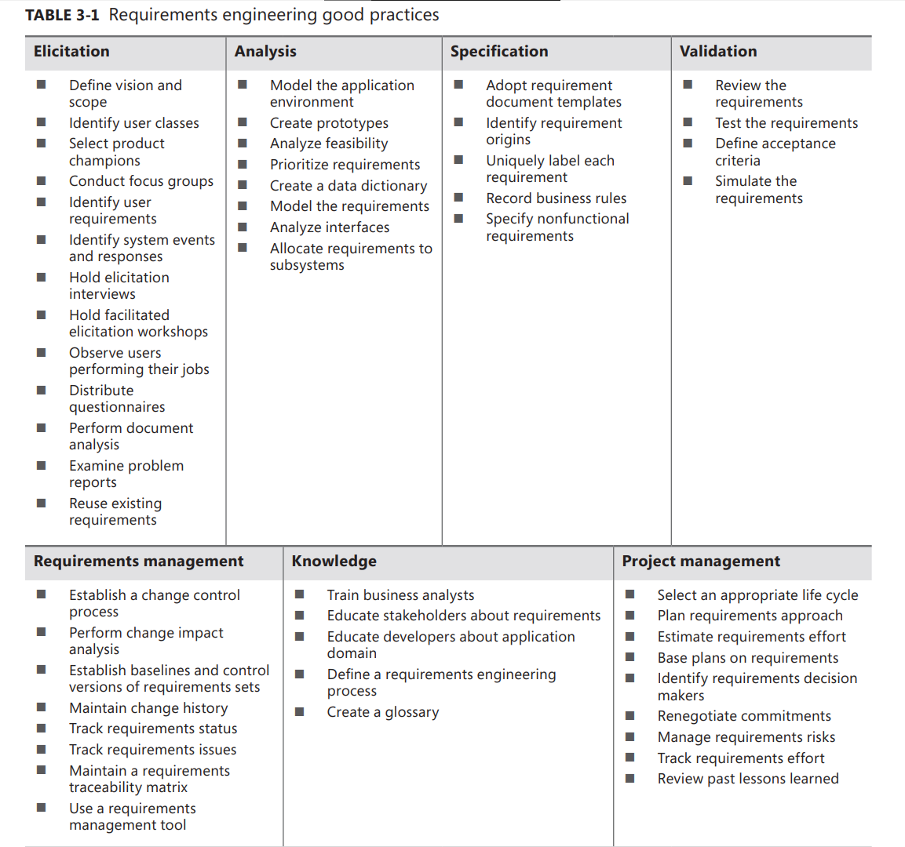
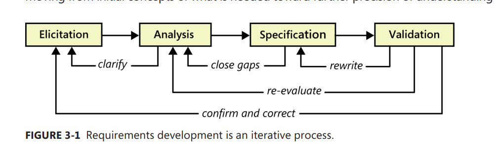
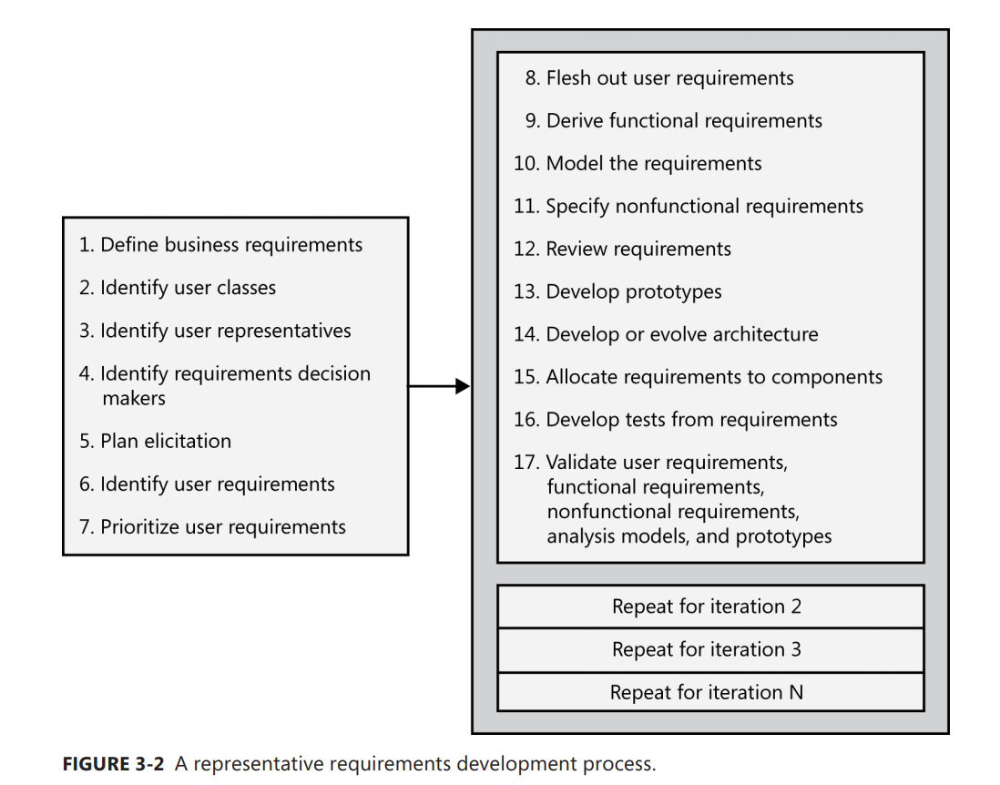

[Back to index](../req_eng_index.md)

## Good practices

## Requirement Development framework

The software requirement development process involves elicitation, analysis, specification, and validation. These activities are not usually perform in a linear way though.

