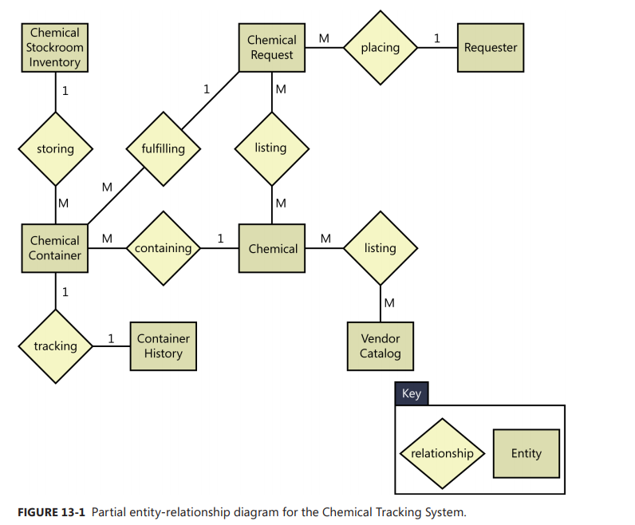

[Back to index](../req_eng_index.md)

# Specifying data requirement

## Modeling data relationships

Entity Relationship Diagram - ERD is commonly used.

> If your ERD represents logical groups of information from the problem domain and their interconnections, you're using the ERD as a requirements analysis tool. When you create ERD during design, you're defining the logical or physical structure of the system's database.

This is Peter - Chen notation
