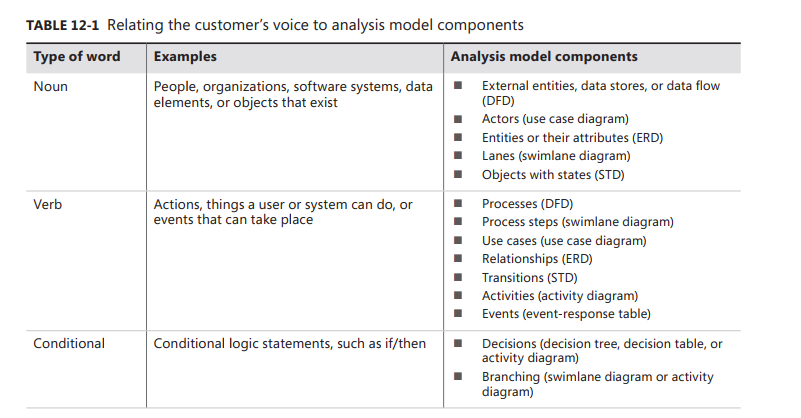
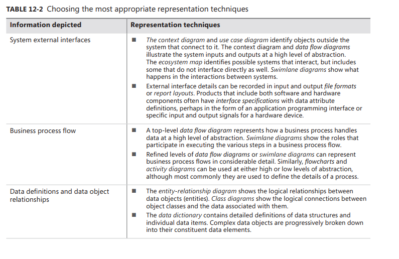
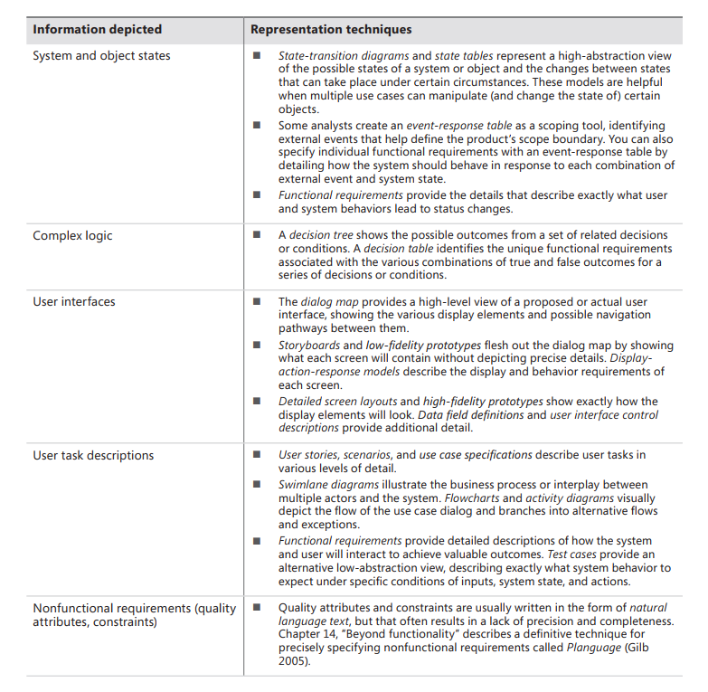
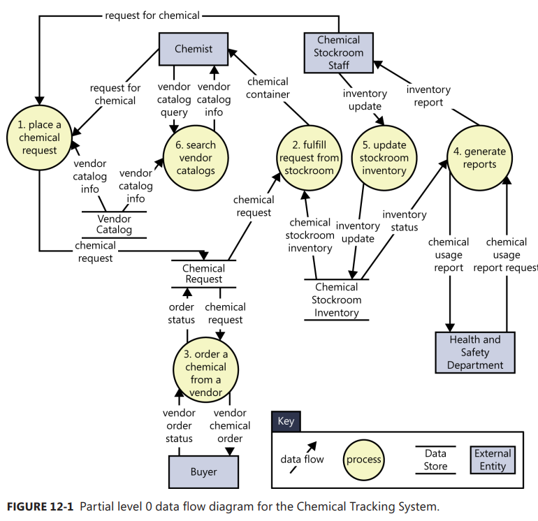
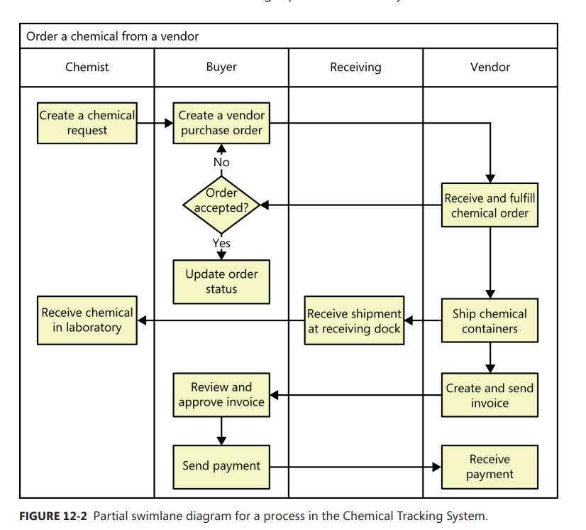
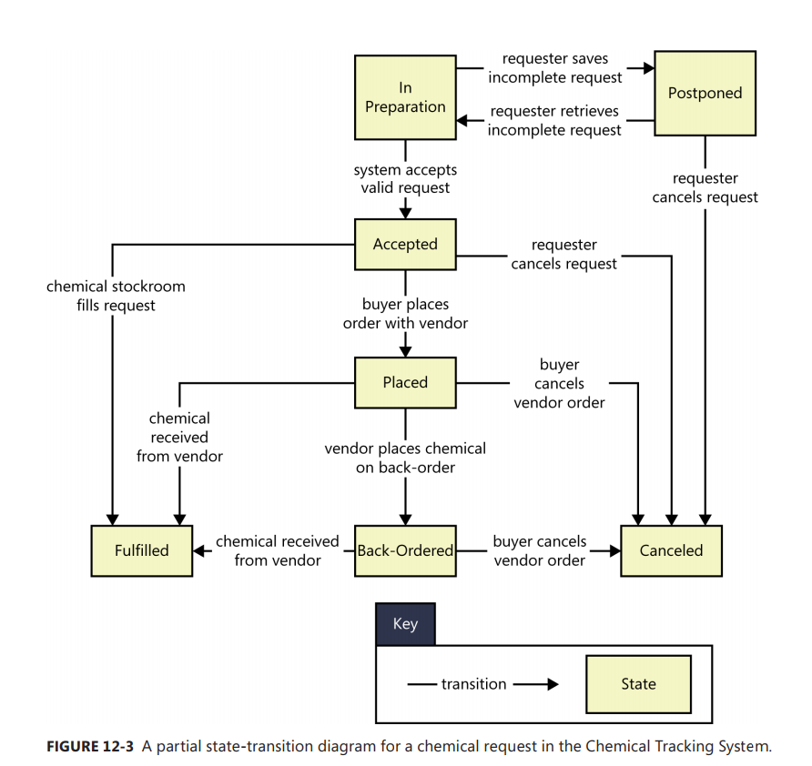
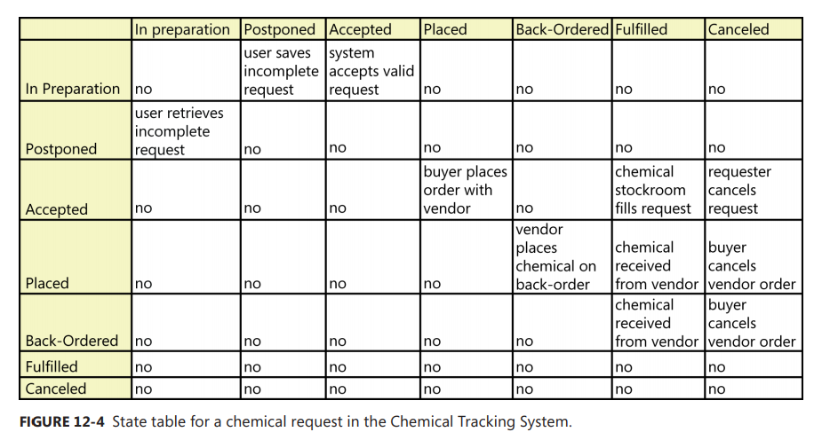
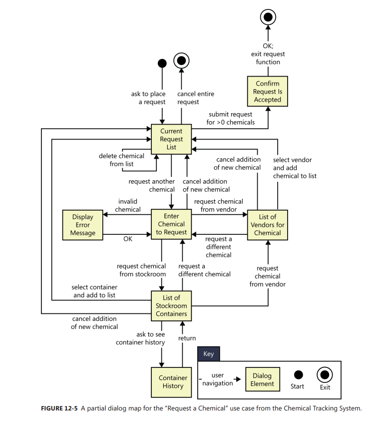

[Back to index](../requirement_development/requirement_modeling.md)

# A picture is worth 1024 words. A model is worth 1024 lines of code.

## Modeling the requirements

There is no technique that encompassing everything together into a holistic depiction of a system's requirements.

> If you could really model the entire sustem in a single diagram, that diagram would be just as unusuable as a long list of requirements on its own.

> Experience has shown that analysis models should augment rather than replace a written requirements specification.

Visual models can help you identify missing, extraneous and inconsistent requirements.

> Inventing your own modeling notations is possible, but it presents more risk of misinterpertation than if you adopt standard notations.

Some notes when modeling:

- You will almost never get a model right the first time through, so iteration is a key to modeling success.
- A model is simpler than the system it is modeling. If you cant handle the complexity of the model, you cant handle the complexity of the system.
- Models (and part of them) can be reuse.
- Models can be used for both analysis purpose and design purpose.

## From voice of the customer to analysis models

> Dont assume that customers aldeady know how to read analysis models, but dont conclude that they're unable to understand them, either. Include a key and explain the notations and purpose of each model to your product champions. Walkthrough a sample model to help them learn how to review each type of diagram.

## Select the right representations

Focus your modeling on the most complex and riskiest protions of the sustem and on those portion most subject to ambiguity and uncertainty.

> Satety-critical, security-critical and mission-critical system elements are good candidates for modeling because the impact of defects in those areas is severe.

## Data flow diagram (or DFD)

DFD show how data moves through a system, which other models dont show well.

DFD can represent systems over a wide range of abstraction.

- High-level DFDs can show a holistic view of the data and processing components. E.g. Context Diagram
- You can elaborate the Context diagram into a level 0 DFD (highest level for data flow models) which partition the system into its major processes.

- Each process that appears as a separate bubble on the level 0 diagram can be firther expanded into a seperate DFD to reveal more detaul about its functioning.
  > This continues until the lowest level diagrams contain only primitive process operations that can be clearly represented in narrative text, pseudocode, a swimlane diagram or an activity diagram. The functional requirements will define precisely what happens within each primitive process.

> Looks complex at first glance. If you examine the immediate environment of any process, you will see the data items that it consumes and produces and their sources and destinations.

Following are several conventions or drawing data flow diagrams. Note, using the models to enhance communication is more important than dogmatic conformance to these principles.

- Processes communicate through data stores, not by direct flows from one process to another. Similarly, data cannot flow directly from one store to another or directly bewteen external entities and data stores; it mist pass through a process bubble.
- Dont attempt to imply the processing sequence using the DFD.
- Name each process as a concise action : verb + object. Use meaningful name.
- Number the process uniquely and hierachially.
  > On lv0 diagram, number beach process with an integer. If you create a child DFD for process 3, number the processes in that child diagram 3.1, 3.2..
- Dont show more than 8 to 10 processes on a single diagram. If you have too many processes, introduce another layer of abstraction by grouping related processes into a higher-level process.
- Bubbles with flows that are only comming in / coming out are sus. DFD Bubbles usually respresent processes that need both input and output.

**Models the problems, not the software**

### Swimlane diagram

> Sometimes called cross-functional diagrams.

A variation of flowcharts, subdivided into visual subcomponents called lanes. The lanes can represent different systems or actors that execute the steps in the process.

Swimlane diagrams are most commonly used to show business processes, workflows, or system and user interactions.

Most commonly used elements:

- Process steps, shown as rectangles
- Transistions between process steps, shown as arrows connecting pairs of rectangles
- Decisions, shown as diamonds with multiple branches leaving each diamond. The choices are shown as text labels on each arrow leaving a diamond.
- Swimlanes to divide the process, show as horizontal / vertical lines on the page. The lanes are roles, departments or systems. They show who or what is executing the steps in a given lane.

> A complete business process might noot fit entirely within the scope of a software system.

## State-transistion diagram and state table

Provide a concise, complete and unambiguous representation of the states of an object or system.

> A related technique is the state machine diagram included in the UML, which has a richer set of notations and which models the states an object goes through during its lifetime

The STD contains three types of elements:

- Possible system states, show as rectangles (some use circles)
- Allowed state changes or transitions, show as arrows connecting pairs of rectangles
- Events or conditions that cause reach transition to take place, shown as text labels on each transition arrow. The label might identify both the event the the corresponding system response.

The STD for an object that passes through a defined life cycle will have one or more termination states, which represent the final status values that an object can have.

A **state table** shows all of the possible transistions between states in the form of a matrix. A business analyst can use state tables to ensure that all transistions are identified bby analyzing every cell in the matrix.

## Dialog map

Represents a UI desing at a high level of abstraction. It shows the dialog elements in the system and the navigation links among them, but it doesnt show the detailed screen designs.

Only one dialog element (such as a menu, workspace, dialog box, line prompt or touch screen display) is available at any given time for user input.

> A dialog map is really just a user interface modeled in the form of a state-stansition diagram.

> A navigation map is a similar technique, but includes a richer set of notations for representing different types of interaction elements and context transition.

> A UI flow is like a dialog map but show navigation path between UI screens like swimlane.

Just as in ordinary STDs, diaglog map shows each dialog element as a state and each allowed naviation option as a transistion. The condition that triggers user interface navigation is shown as a text label in the transistion arrow.

There are several types of trigger conditions:

- A user action, such as pressiong a function key, clicking on a hyperlink or making a gesture on a touch screen.
- A data value, such as an invalid user input that triggers an error message display.
- A system condition, such as printer out of paper.
- Some combination of these.

