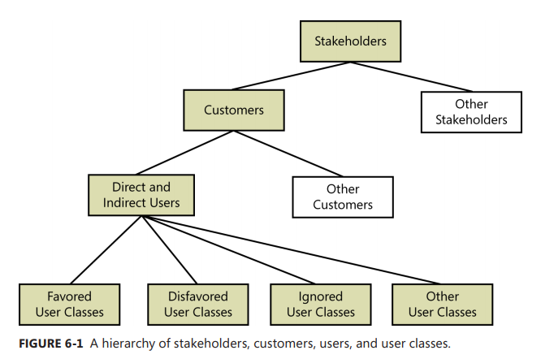
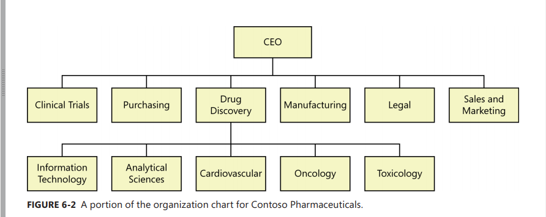
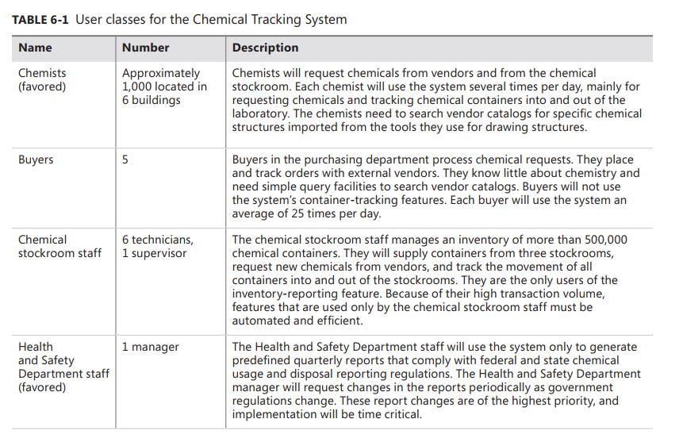

[Back to index](../req_eng_index.md)

# Finding the voice of users

Customer involvement is a critical factor in delivering excellent software. Sucess in software requirements, and hence in software development, depend on getting the voice of user close to the ear of the developer.

To find the voice of user, take the following steps:

- Identifying the different classes of users for your product.
- Select and work with individuals who represent each user class and other stakeholder groups.
- Agree on who are the requirements decision makers are for you project.

You must me careful that, the features users presenting as what they "want" is not necessary the features that they need. User's voice should not be the only major input.

## User classes

People often talk about “the user” for a software system as though all users belong to a monolithic group with similar characteristics and needs. In reality, most products of any size appeal to a diversity of users with different expectations and goals.

A product’s users might differ - among other ways - in the following respects, and you can group users into a number of distinct user classes based on these sorts of differences:

- Their access privilege or security levels (such as ordinary users, guest users, admins...)
- The tasks they perform during their business operations
- The features they use
- The frequency with which they use the product
- Their application domain experience and computer systems
- The platforms they will be using
- Their native language
- Whether they will interact with the system directly of indirectly.
- Their native language
- Whether they will directly or indirectly interact with the system.

### Hierachy of user classes

We can even classify user classes!

- Flavored user classes are those whose satisfaction is most closely aligned with the project's business objectives.

  > This mean that the one who paying for the system isn't necessary be favored.

- Disfavored user classes are groups who aren't supposed to use the product for legal, security or safety reasons.

  > a.k.a bad actors

- You might elect to ignore still other user classes. Yes, they will use the product, but you don’t specifically build it to suit them.

- There are also indirect user classes. They won’t use your application themselves, instead accessing its data or services through other applications or through reports. Your customer once removed is still your customer.

- User classes need not be human beings. They could be software agents performing a service on behalf of a human user, such as bots.

### Notes

It’s tempting to group users into classes based on their geographical location or the kind of company they work in. These distinctions really represent different market segments, though, not different user classes.

> One company that creates software used in the banking industry initially considered distinguishing users based on whether they worked in a large commercial bank, a small commercial bank, a savings and loan institution, or a credit union.

A better way to identify user classes is to think about the tasks that various users will perform with
the system.

> All of those types of financial institutions will have tellers, employees who process loan
> applications, business bankers, and so forth. The individuals who perform such activities—whether
> they are job titles or simply roles—will have similar functional needs for the system across all of the
> financial institutions. Tellers all have to do more or less the same things, business bankers do more or
> less the same things, and so on. More logical user class names for a banking system therefore might
> include teller, loan officer, business banker, and branch manager. You might discover additional user
> classes by thinking of possible use cases, user stories, and process flows and who might perform them.

## Identifying user classes

Identify and characterize the different user classes for your product early in the project so you can elicit requirements from representatives of each important class.

A good way to do this is to use the organization chart. Nearly all of ther potential users for the system are likely to be found somewhere in this chart.

Study the chart, looking for :

- Department that participate in the business process.
- Department that are affected by the business process.
- Departments or role names in which either direct or indirect users might be found.
- User classes that span multiple departments
- Departments that might have an interface to external stakeholders outside the company.

> Document the user classes and their characteristics, responsibilities, and physical locations in
> the software requirements specification (SRS) or in a requirements plan for your project. Check that
> information against any information you might already have about stakeholder profiles in the vision
> and scope document to avoid conflicts and duplication. Include all pertinent information you have
> about each user class, such as its relative or absolute size and which classes are favored.

