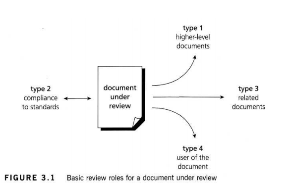

[Back to index](./test_index.md)

# Static techniques

Oppose to **Dynamic testing** - testing with working code, **Static testing** involves examining the software work products. Dynamic testing can only be applied to code, wite Static testing can be used on both code and other documents.

- Reviews
- Static analysis

The use of static testing on software work products has various advantages:

- Static testing can start early in the life cycle, early feedback on quality issues can be established, e.g. an early validation of user requirements and not just late in the life cycle during acceptance testing.
- By detecting defects at an early stage, rework costs are most often relatively low and thus a cheap improvement of the quality of software products can be achived.
- Rework effort is subtantially reduced. Development productivity figures are likely to increase.
- The evaluation by a team has the additional advantage that there is an exchange of information between the participants.
- An increased awareness of quality issues.

## Review

Reviews vary from very informal to formal. Inspection is the most documented and formal review technique, althought it is certainly not the only one.

> In practice, the informal review is perhaps the most common type of review. Informal reviews are applied at various times during the early stages in the life cycle of a document. Informal reviews come in various shapes and forms, but all have one characteristic in common - they are not documented.

### Phases of a **formal** review

> (this should be considered an example. the process could be changed.)

1. Planning
2. Kick-off
3. Preparation
4. Review meeting
5. Rework
6. Follow-up

#### Planning

The review proccess begin with a "request for review" by the author to the **moderator** (or inspection leader, who takes care of the scheduling). Usually, **Entry check** (ensure that the document is ready for review) is carried out and **exit criteria** is defined.

This can be considered a minimum set for **entry check**

- A short check of a product sample by the moderator (or an expert) does not reveal a large number of major defects. (should be defined as a specific number : less than 5 major defects / 3 pages, for example)
- The document to be reviews is available with line numbers.
- All automated check are run and cleared.
- References needed for the inspection are stable and available.
- The document author is prepared to join the review team and feels confident with the quality of the document.

If the document passed, the mod and the author decide with part of the document to review. Usually the maximum size is between 10 and 20 pages.

> Sometime, only a page or two are inspected in depth to find the most serious defects that are not obvious.

Then, the mod and the author decide the composition of the review team.

> The team usually consists of four to six participants.

To improve the effectiveness of the review, roles are assigned to each participants which help the reviewers focus on particular types of defects during checking.

> The moderator could take a role, which improves the review efficiency because the mod replaces an engineer who would otherwise have to check the document and attend the meeting. It is also recommended that the mod take the role of checking compliance to standards, since this tends to be a highly objective role, which leads to less discusson of the defects found.

#### Kick-off

An optional step is the kick-off meeting. The goal of the meeting is to get everyone on the same wavelength regarding the document-under-review and to commit to the schedule.

During the kick-off

- The objective of the review and the document is briefly introduced.
- The entry check and the exit criteria is discussed
- The Relationships between the document-under-review and other related documents are explained.
- Role assignments, checking rate, the pages to be checked, process changes (and any other questions) are also discussed.

Ofcourse, distribution of documents can also be done.

> In general, a kick-off is highly recommended since there is a strong positive effect of a kick-off meeting on the motivation of reviewers and the effectiveness of review process. At customer sites, up to 70% more major defects found per page as a result of performing a kick-off.

#### Preparation

The participants work individually on the doc-under-review using the related documents, procedures, rules and checklists provided. The individual participants identify defects, questions and comments, according to their understanding of the document and role. All issues are recorded.

## Static Analysis

- Static analysis is performed on requirements, design or code without actually executing the software artifact being examined.
- Static analysis is ideally performed before of formal reviews
- Static analysis is unrelated to dynamic properties of the requirements, design and code, such as test coverage.
- The goal of static analysis is to find defects, whether or not they may cause failures. As with reviews, static analysis finds defects rather than failures.

For static analysis there are many tools, and most of them focus on software code. Static analysis tools are typically used by developers before, and sometimes during, component and integration testing and by designers during software modeling. The tools can show not only structural attributes (code metrics), such as depth of nesting or cyclomatic number and check against coding standards, but also graphic depictions of control flow, data relationships and the number of distinct paths from one line of code to another.

Static analysis can provide these values

- Early detection of defects prior to test execution.
- Early warning about suspicious aspects of the code, design or requirements
- Identification of defects not easily found in dynamic testing.
- Improve maintainability of code and design (since engineers work accrding to documented standards and rules)
- prevention of defects, provided that engineers are willing to learn from their errors and continuous improvement is practised.

### Coding standards

### Code metrics

When performing static analysis, information is usually calculated about structural attributes of the code like comment frequency, depth of nesting, cyclomatic complexity and line count of code.

Complexity metrics identifying high risk, complex areas.

**Cyclomatic complexity** is based on the number of decisions in a program.

#### Control flow

In computer science, control flow (or flow of control) is the order in which individual statements, instructions or function calls of an imperative program are executed or evaluated. The emphasis on explicit control flow distinguishes an imperative programming language from a declarative programming language.

The control flow structure addresses the sequence in which the instructions are executed. This aspect of structure reflects the iterations and loops in the program's design.

Control flow analysis can be used to identify unreachable code. In fact many of the code metrics relate to control flow structure e.g. number of nested levels or cyclomatic complexity.

#### Data flow

Data flow structure follows the trail of data items as it is accessed and modified by the code. Many times, the transactions applied to data are more complex than the instructions that implement them. Defect can be found such as referencing an variable with undefined value and unused variables.

> When data is organized as lists, queues, stacks or other well-defined structures, the algorithms used to CRUD them are more likely to also be well-defined. That is, sometimes a prograam is complex becuz it has complex data structure, rather than because of the complexity of control flow.
