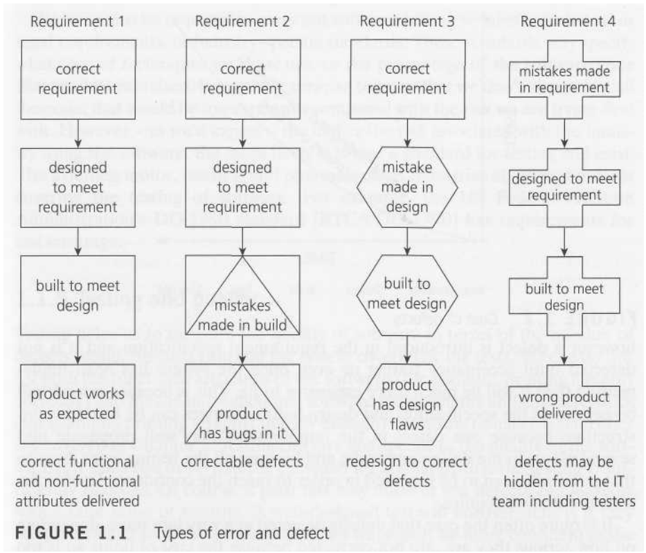

[Back to index](./index.md)

## What is testing?

- Is a process rather than a single activity - there are a series of activities involved

- Takes place throughout the software development life cycle.

- Both static - as in reviewing codes and documents - and dynamic - running the test to see whether it ran right or not

- Need planning, prepraration and evaluation

- We don't just test code. We test the requirements and design specifications, and we test related documents such as operation, user and training material.

## Why is testing necessary?

- Determine that (software products) satisfy specified requirements
- Demonstrate that (software products) are fit for purpose
- Detect defects

### Terminology

If someone makes an **error** or mistake in using the software, this may lead directly to a problem - the software is used incorrectly and so does not behave as we expected. However, people also design and build the software and they can make mistakes during the design and build. These mistakes mean that there are flaws in the software itself. These are called **defects** or sometimes bugs or
faults. Remember, the software is not just the code; check the definition of software again to remind yourself.
When the software code has been built, it is executed and then any defects may cause the system to fail to do what it should do (or do something it shouldn't), causing a **failure**. Not all defects result in failures; some stay dormant in the code and we may never notice them.

It is not just defects that give rise to failure. Failures can also be caused by environmental conditions as well: for example, a radiation burst, a strong magnetic field, electronic fields, or pollution could cause faults in hardware or firmware. Those faults might prevent or change the execution of software.

Failures may also arise because of human error in interacting with the software, perhaps a wrong input value being entered or an output being misinterpreted. Finally, failures may also be caused by someone deliberately trying to cause a failure in a system - malicious damage. When we think about what might go wrong we have to consider defects and failures arising from:

- errors in the specification, design and implementation of the software and system;
- errors in use of the system;
- environmental conditions;
- intentional damage;
- potential consequences of earlier errors, intentional damage, defects and failures

### Type of defect

Requirements and design defects are not rare; assessments of
thousands of projects have shown that defects introduced during requirements and design make up close to half of the total number of defects.

The longer a defect stay in the life cycle, the more costly it become to fix that defect.

## Principles

1. Testing only show presence of defects
   > Testing can show that defects are present, but cannot prove that there are no defects. Testing reduces the probability of undiscovered defects remaining in the software but, even if no defects are found, it is not a proof of correctness.
2. Exhaustive testing is impossible
   > Testing everything (all combinations of inputs and preconditions) is not feasible except for trivial cases. Instead of exhaustive testing, we use risks and priorities to focus testing efforts
3. Early testing
   > Testing activities should start as early as possible in the software or system development life cycle and should be focused on defined objectives.
4. Defect clustering
   > A small number of modules contain most of the defects discovered during pre-release testing or show the most operational failures.
5. Pesticide paradox
   > If the same tests are repeated over and over again, eventually the same set of test cases will no longer find any new bugs. To overcome this 'pesticide paradox', the test cases need to be regularly reviewed and revised, and new and different tests need to be written to exercise different parts of the software or system to potentially find more defects.
6. Testing is context dependent
   > Testing is done differently in different contexts. For example, safety-critical software is tested differently from an e-commerce site.
7. Absence of error fallacy
   > Finding and fixing defects does not help if the system built is unusable and does not fulfill the users' needs and expectations.

## Fundamental test process

- planning and control
- analysis and design
- implementation and execution
- evaluating exit criteria and reporting
- test closure activities

## Psychology of testing

### Unit test

Test a "unit" of code, usually a function

### Integration test

Test how modules interact with each other

### System test

Test the whole system

###
